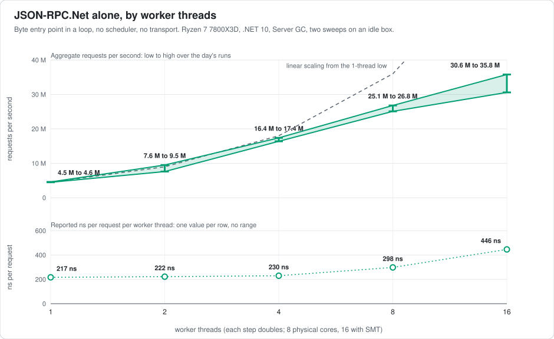
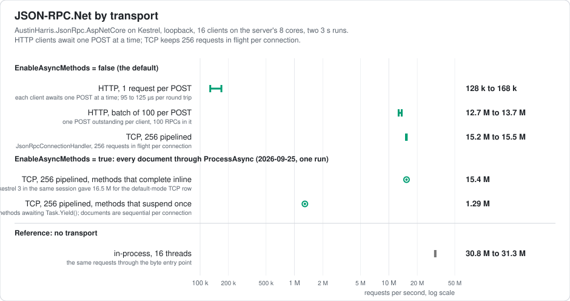
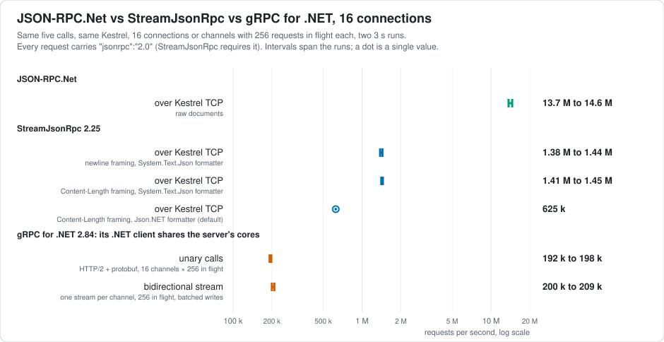
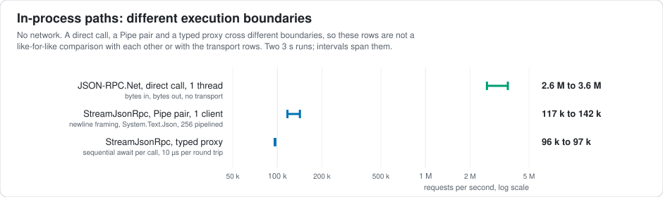
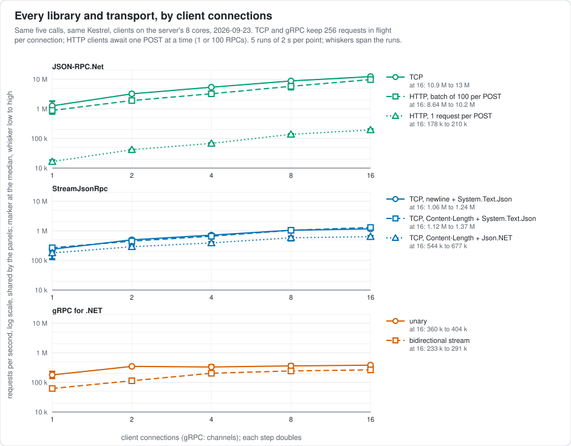

# JSON-RPC.Net

 

JSON-RPC.Net is a [JSON-RPC 2.0](https://www.jsonrpc.org/specification) server for .NET. You give it a request document and it gives you the response document, bytes in and bytes out; the transport is yours. Host it in Kestrel, a console app, sockets, pipes, or a Blazor WebAssembly page.

Version 2.0 rebuilt the pipeline around UTF-8 bytes and made the JSON serializer pluggable. The core depends on no JSON library: Json.NET and System.Text.Json ship as separate packages, and the built-in serializer needs neither. On one core it answers a small request in about 217 ns, with no allocation for numeric parameters. A Kestrel host on an 8-core desktop answers over 14 million requests per second over pipelined TCP. [Benchmarks](#benchmarks) gives the method and the full tables.

It is a server only. There are no client proxies and no server-to-client calls. If you need a bidirectional RPC framework, look at [StreamJsonRpc](https://www.nuget.org/packages/StreamJsonRpc); the benchmarks compare the two.

This README and the package guides are also published at [astn.github.io/JSON-RPC.NET](https://astn.github.io/JSON-RPC.NET/). What the library does by default and what it leaves to you is under [Security](#security).

- [Packages](#packages)
- [Requirements](#requirements)
- [Installation](#installation)
- [Getting started](#getting-started)
- [Defining methods](#defining-methods)
- [Hosting](#hosting)
- [Errors](#errors)
- [Asynchronous methods and cancellation](#asynchronous-methods-and-cancellation)
- [Sessions and context](#sessions-and-context)
- [Configuration](#configuration)
- [Security](#security)
- [Benchmarks](#benchmarks)
- [Upgrading from 1.x](#upgrading-from-1x)
- [Versioning and support](#versioning-and-support)
- [Building](#building)
- [License](#license)

## Packages

All four packages are MIT licensed and ship together with the same version number.

| Package | What it is |
| --- | --- |
| `AustinHarris.JsonRpc` | The server. Envelope parsing, method dispatch, parameter binding, error mapping, sessions. Ships with the built-in serializer, `JsmnSerializer`: a span port of the [jsmn](https://github.com/zserge/jsmn) tokenizer plus a cached reflection mapper, with no JSON library behind it. |
| `AustinHarris.JsonRpc.Newtonsoft` | Json.NET 13 serializer. The compatibility choice: `JsonSerializerSettings`, `[JsonProperty]`, converters, lenient input. |
| `AustinHarris.JsonRpc.SystemTextJson` | System.Text.Json serializer. `JsonSerializerOptions`, `Utf8JsonReader`/`Utf8JsonWriter` straight on the request bytes. |
| `AustinHarris.JsonRpc.AspNetCore` | Kestrel hosting: an HTTP endpoint on `PipeReader`/`BodyWriter`, a `ConnectionHandler` for raw TCP, Unix socket and named pipe connections, and DI registration of services. |

## Requirements

`AustinHarris.JsonRpc`, `.Newtonsoft` and `.SystemTextJson` target:

| Target | Covers |
| --- | --- |
| `netstandard2.0` | .NET Framework 4.6.1+, .NET Core 2.0+, Mono 5.4+, Xamarin, Unity 2018.1+ |
| `netstandard2.1` | .NET Core 3.0+, Mono 6.4+, Xamarin |
| `net8.0` | .NET 8 (LTS) |
| `net10.0` | .NET 10 (LTS) |

`AustinHarris.JsonRpc.AspNetCore` targets `net8.0` and `net10.0`.

The "Covers" column is what each target framework admits, not what is tested. CI runs the test suite on `net8.0` and `net10.0`; the WebAssembly sample is built in CI and run by hand. The other runtimes can load the `netstandard` assets but are not part of the test matrix. On .NET Framework, 4.7.2 or later avoids the binding redirects that 4.6.1 to 4.7.1 need for `netstandard2.0` libraries.

Dependencies at 2.0.0: none on `net8.0` and `net10.0`; on `netstandard` only, `System.Memory` 4.6.3, and `netstandard2.0` also references `System.Threading.Tasks.Extensions` 4.5.0 for `ValueTask`. The Newtonsoft package depends on Newtonsoft.Json 13.0.4 and the System.Text.Json package on System.Text.Json 10.0.3.

The core uses no reflection emit, so it runs under the WebAssembly interpreter and under WebAssembly AOT (see [samples/WasmHost](samples/WasmHost)). It is not annotated for trimming: services and their `[JsonRpcMethod]` members are found by reflection, so keep those types rooted if you publish trimmed.

## Installation

```
dotnet add package AustinHarris.JsonRpc --prerelease
```

2.0 is published as `2.0.0-preview.1`; without `--prerelease`, NuGet resolves to the last 1.x release.

Add `AustinHarris.JsonRpc.Newtonsoft` or `AustinHarris.JsonRpc.SystemTextJson` if you want that serializer, and `AustinHarris.JsonRpc.AspNetCore` to host in Kestrel.

## Getting started

### 1. Declare a service

Derive from `JsonRpcService` and mark the methods you want to expose with `[JsonRpcMethod]`. Constructing the service registers it, so you only need to keep the instance alive.

```csharp
using AustinHarris.JsonRpc;

public class CalculatorService : JsonRpcService
{
    [JsonRpcMethod]                 // exposed as "add"
    private double add(double l, double r) => l + r;

    [JsonRpcMethod("multiply")]     // exposed under an explicit name
    public int Multiply(int l, int r) => l * r;

    [JsonRpcMethod]
    public string StringMe(string x) => x;
}
```

Methods can be `private`; parameters may be positional (`"params":[1,2]`) or named (`"params":{"l":1,"r":2}`). Optional parameters with default values are honoured, and a parameter's JSON name can be overridden with `[JsonRpcParam("name")]`.

Every method lives in a *session*, a named set of methods. Everything above goes into the default session (`Handler.DefaultSessionId()`), which is all most applications need. Overloads that take a `sessionId` let one process serve separate method sets; see [Sessions and context](#sessions-and-context).

### 2. Process requests

```csharp
using System;
using System.Buffers;
using System.Text;
using AustinHarris.JsonRpc;

var service = new CalculatorService();   // binds itself to the default session; keep a reference

// Strings, asynchronous invocation.
string response = await JsonRpcProcessor.ProcessAsync("{\"jsonrpc\":\"2.0\",\"method\":\"add\",\"params\":[1,2],\"id\":1}");
// {"jsonrpc":"2.0","result":3.0,"id":1}

// Strings, synchronous, on the calling thread. Named parameters.
string sync = JsonRpcProcessor.ProcessSync("{\"method\":\"multiply\",\"params\":{\"l\":6,\"r\":7},\"id\":2}");
// {"jsonrpc":"2.0","result":42,"id":2}

// Bytes: the native path. The string overloads transcode into it.
byte[] request = Encoding.UTF8.GetBytes("{\"method\":\"add\",\"params\":[2,3],\"id\":3}");
var output = new ArrayBufferWriter<byte>();
JsonRpcProcessor.Process(Handler.DefaultSessionId(), request.AsSpan(), output);
Console.WriteLine(Encoding.UTF8.GetString(output.WrittenSpan));   // nothing is written for a notification
```

Batches (`[{...},{...}]`) and notifications (requests without an `id`) are handled per the spec: a batch answers with an array, a notification produces nothing. The byte overloads take `ReadOnlySpan<byte>`, `ReadOnlyMemory<byte>` or `ReadOnlySequence<byte>`; pass a `byte[]` as `AsSpan()`, because on C# 12 a bare array is ambiguous between the memory and span overloads.

That is the whole server. The rest of this page is about exposing methods, putting a transport in front, and what happens when things go wrong.

## Defining methods

### Classes

Any class works, not only `JsonRpcService` subclasses: bind an instance with `ServiceBinder.BindService(sessionId, instance)`. A `JsonRpcService` subclass binds itself to the default session in its parameterless constructor. Write `: base(false)` for a subclass that something else binds (the AspNetCore host binds every registered service to its effective session) and `: base(sessionId)` to bind to another session.

An instance bound with `BindService(sessionId, instance)` serves every request on every thread, so it must be thread-safe. `BindService(sessionId, typeof(T), resolve)` binds a type instead: right before each call the resolver is handed the RPC context and returns the instance to invoke, which is how a container's scoped and transient lifetimes reach a method (the AspNetCore package does this for `AddJsonRpcService<T>(ServiceLifetime.Scoped)`; see [Kestrel HTTP endpoint](#kestrel-http-endpoint)). The core takes no dependency on any container: the resolver is a plain delegate, so Microsoft.Extensions.DependencyInjection, Autofac and a hand-written factory all fit. Static methods never resolve.

### Delegates

A method does not need a class at all. Any delegate becomes a method with `ServiceBinder.BindMethod`; a lambda keeps its parameter names for named params:

```csharp
ServiceBinder.BindMethod("add", (double l, double r) => l + r);
ServiceBinder.BindMethod("greet", (string who) => "hello " + who);                            // {"method":"greet","params":{"who":"you"}}
ServiceBinder.BindMethod(sessionId, "scale", (double v, double f) => v * f,
    parameterNames: new[] { "value", null }, defaults: new Dictionary<string, object> { ["f"] = 10 });
ServiceBinder.UnbindMethod("add");
```

A name already registered on the session is an error (unbind it first); a delegate whose parameter names cannot be recovered (a closed delegate created with `Delegate.CreateDelegate`) gets `arg1`, `arg2`, ... unless you pass names. `Task` and `ValueTask` delegates are served by `ProcessAsync`; see [Asynchronous methods and cancellation](#asynchronous-methods-and-cancellation).

### Interfaces

An interface can define the exposed contract, including a tree of interface-typed properties. Implementation-only methods stay private to the host; parameter names, `[JsonRpcParam]`, aliases and optional defaults come from the interface:

```csharp
public interface IWorld { ICharacter Character { get; } IAdmin Admin { get; } }
public interface ICharacter { void MoveAndRotate(float distance, float roll = 0, int ticks = 1); }
public interface IAdmin { ICharacter Character { get; } }

RpcBinding binding = ServiceBinder.BindInterface<IWorld>(sessionId, world);
// Character.MoveAndRotate and Admin.Character.MoveAndRotate
binding.Dispose(); // unbinds this tree, leaving later replacements alone

using var characterOnly = ServiceBinder.BindInterface<IWorld>(sessionId, world,
    new RpcInterfaceBindingOptions { Include = m => m.Path.Length == 1 });
// Include can also inspect m.Method for the host's own interface attributes.
```

Each interface-typed property becomes a name segment, so `IWorld.Character.MoveAndRotate` is exposed as `Character.MoveAndRotate`. The whole tree is walked and compiled when you call `BindInterface`, so a request pays nothing for it.

What happens at registration:

- Each property getter runs once, and the object it returns is the one that serves calls. Setting the property later changes nothing. A getter may have side effects; they happen once and are not undone if registration fails.
- Registration is all or nothing. It throws, exposing no method, on an empty or duplicate name, a name starting with `rpc.`, a name already bound in the session, a null or throwing getter, a cycle, or a path deeper than 32 properties.
- Inherited members, explicit implementations and closed generic interfaces are supported. Generic methods and default interface method bodies are rejected.

Naming, through `RpcInterfaceBindingOptions`:

| Option | Default | Effect |
| --- | --- | --- |
| `Recursive` | `true` | `false` binds only the root interface's methods |
| `Prefix` | `""` | prepended to every generated name |
| `Separator` | `"."` | joins property segments and the method name |
| `Casing` | `Preserve` | `CamelCase` lower-cases the first letter of each generated segment (invariant culture) |
| `Include` | all | a predicate over `RpcInterfaceMethod` (`Path`, `Method`, `Interface`, `Leaf`, `DefaultName`) |
| `NameRule` | none | returns the complete wire name, replacing the rules above |

An explicit `[JsonRpcMethod("alias")]` on an interface method is used as written. `Task` and `ValueTask` members are served by `ProcessAsync`; `[JsonRpcMethod(ContextFlow = RpcContextFlow.Flow)]` on the interface member opts into context flow across awaits (see [Asynchronous methods and cancellation](#asynchronous-methods-and-cancellation)).

`BindInterface` returns an `RpcBinding`. Disposing it unbinds exactly this tree (not a later registration under the same names), is safe to call twice, and does not dispose your objects. Calls already dispatched finish on the implementation they started with.

## Hosting

The core is transport-agnostic. Pick whichever of these fits, or build your own on the byte entry point.

### In-process (strings or bytes)

Call the processor yourself, as in [Getting started](#getting-started). The byte overloads take what a `PipeReader` gives you (`ReadOnlySequence<byte>`) and write to any `IBufferWriter<byte>`: a `PipeWriter`, a socket buffer or `HttpResponse.BodyWriter`. Nothing is written for a notification, so check `output.WrittenCount` before sending. If your transport carries several documents per connection, `JsonFramer.TryReadDocument` cuts complete documents out of the byte stream without parsing them.

### Kestrel HTTP endpoint

```csharp
using AustinHarris.JsonRpc.AspNetCore;

var builder = WebApplication.CreateBuilder(args);
builder.Services.AddJsonRpc();
builder.Services.AddJsonRpcService<CalculatorService>();   // built by DI; any class with [JsonRpcMethod] works

var app = builder.Build();
app.MapJsonRpc("/rpc");                                    // POST /rpc; compose with RequireAuthorization() etc.
app.Run();
```

A request or batch answers `200 application/json`; a notification answers `204`. The body goes from `PipeReader` to `BodyWriter` without becoming a string. Inside a method, `JsonRpcContext.Current().Value` is the `HttpContext`.

`AddJsonRpcService<T>()` registers `T` as a singleton: resolved once from the root container when the host starts, one instance for every request on every thread, so it must be thread-safe and cannot take scoped dependencies such as an EF Core `DbContext` (a singleton uses `IDbContextFactory<T>`, or captures `((HttpContext)Handler.RpcContext()).RequestServices` before its first `await`). `AddJsonRpcService<T>(ServiceLifetime.Scoped)` (or `Transient`) resolves `T` per call from the request's provider instead: `HttpContext.RequestServices` on HTTP, a scope the raw connection handler opens and disposes per document. A `DbContext` then goes in the constructor as usual, every call of a batch shares one scope, and a transient is created per call. A lifetime that disagrees with an existing registration of `T` is refused, at registration or at startup. To await `Task` and `ValueTask` methods, set `o.EnableAsyncMethods = true` in `AddJsonRpc`; the request is then cancelled when the client disconnects (`RequestAborted`). The other options (session per request, serializer, body size limit, content type) and the per-endpoint overload `MapJsonRpc(pattern, options)` are in the [package README](AustinHarris.JsonRpc.AspNetCore/README.md).

### Kestrel raw connections (TCP, Unix socket, named pipe)

```csharp
builder.WebHost.ConfigureKestrel(k =>
{
    k.ListenLocalhost(9000, l => l.UseConnectionHandler<JsonRpcConnectionHandler>());
    // k.ListenUnixSocket("/tmp/rpc.sock", l => l.UseConnectionHandler<JsonRpcConnectionHandler>());
    // k.ListenNamedPipe("rpc", l => l.UseConnectionHandler<JsonRpcConnectionHandler>());
});
```

Clients write JSON documents back to back (whitespace or newlines between them are fine) and read the responses in the same order, also back to back with no separator; notifications produce nothing. The framer accepts strict JSON only, so single-quoted strings and other lenient syntax are refused on a raw connection even with the Json.NET serializer.

A raw connection has no authentication, authorisation or rate limiting; those are HTTP middleware and do not run here. Listen on loopback or a Unix socket, or put something in front that authenticates. A document larger than `MaxRequestBytes` (4 MB) aborts the connection.

With `EnableAsyncMethods = true`, documents on one connection are processed one at a time in order, and replies already finished are flushed before the connection waits on a slow method. Separate connections run concurrently.

### Blazor WebAssembly

The core runs inside the browser. [samples/WasmHost](samples/WasmHost) is a Blazor WebAssembly app where JavaScript hands a request document to a `[JSExport]`/`[JSInvokable]` method that calls the processor and returns the response, with no HTTP involved. The same service class then serves both the browser and the server. The sample page also benchmarks JSON-RPC against plain Blazor interop; the numbers are in its README.

### Classic ASP.NET (System.Web)

`AustinHarris.JsonRpc.AspNet` is a 1.x package and is not part of 2.0. It targets .NET Framework 4.0, and the 2.0 core needs `netstandard2.0` (.NET Framework 4.6.1 or later), so the two cannot be combined. To host in System.Web on 2.0, call `JsonRpcProcessor.ProcessSync` from your own `IHttpHandler`.

## Errors

### Exception disclosure

By default (`Config.IncludeExceptionDetails = false`), an unhandled exception thrown by a method, or thrown while its result is written, becomes `-32603 Internal Error` with `data: null`. Nothing about the exception leaves the process: not its type name, not its message. The redaction happens when the response is written, after the error handler ran, so a handler still sees the original `Exception` in `data` and can decide what the client gets instead:

```csharp
Config.SetErrorHandler((request, error) =>
    error.data is Exception ex ? new JsonRpcException(-32000, "Server error", Log(ex)) : error);
```

Set `Config.IncludeExceptionDetails = true` only for trusted development clients: `data` then carries the full `ExceptionInfo` (`ClassName`, `Message`, `Source`, `StackTraceString`, `HResult` and the `InnerException` chain).

A `JsonRpcException` thrown by the application, or returned by an error handler, keeps the `data` it was given; that data is authored, not redacted.

### Handlers

Throw `JsonRpcException(code, message, data)` to return an error of your own. To reshape errors, or to inspect requests on the way in and out, register handlers. Each handler belongs to one session:

```csharp
// Default session
Config.SetErrorHandler((request, exception) => new JsonRpcException(-32000, "Server error", exception.data));
Config.SetParseErrorHandler((rawJson, exception) => exception);
Config.SetPreProcessHandler((request, context) => null);              // return a JsonRpcException to reject; may replace Method/Params/Id
Config.SetPostProcessHandler((request, response, context) => null);   // return a JsonRpcException to replace the result

// Another session: other sessions do not inherit the default session's handlers
Config.SetErrorHandler("client-42", (request, exception) => exception);
Config.SetParseErrorHandler("client-42", (rawJson, exception) => exception);
Config.SetPreProcessHandler("client-42", (request, context) => null);
Config.SetPostProcessHandler("client-42", (request, response, context) => null);
```

The overloads without a session id set the **default session's** handler, not a process-wide one; the overloads with a session id create the session when it does not exist yet, and a null handler clears only that session's. A pre- or post-process handler moves its session onto a slower path, which builds `JsonRequest` and `JsonResponse` objects for the handler to see. Leave them unset unless you need them. (`Config.SetBeforeProcessHandler(sessionId, …)`, the 1.x name, still works and is marked obsolete.)

### Error codes

The errors the library raises itself carry structured `data`, identical for every serializer, and the error handler receives the same object:

| Code | `error.data` | Object seen by the error handler |
| --- | --- | --- |
| `-32601` Method not found | `{"method":"<name as requested>"}` | `MethodNotFoundInfo` |
| `-32602` Invalid params: count, missing, unknown or repeated named parameter | a sentence, e.g. `"Named parameter 'b' was not present."` | `string` |
| `-32602` Invalid params: a value the serializer could not convert | `{"reason":"conversion","parameter":"b","index":1,"expectedType":"int32"}` plus `"message"` when `Config.IncludeExceptionDetails` is on; the value sent is never echoed | `ParameterErrorInfo` (with the serializer's exception in `Cause`) |
| `-32603` Internal error: the method threw, its result could not be written, or a parameter's type is one the serializer cannot handle | `null`, or the full `ExceptionInfo` when `Config.IncludeExceptionDetails` is on, see [Exception disclosure](#exception-disclosure) | `Exception` |

In the second `-32602` row, "could not convert" means the serializer refused the value (`JsonRpcBindException`, `FormatException`, `OverflowException`, `InvalidCastException`, or any `JsonException` from System.Text.Json or Json.NET); what each serializer accepts (say `"7"` for an `int`) is its own decision, see [docs/serializers.md](docs/serializers.md).

## Asynchronous methods and cancellation

A method may return `Task`, `Task<T>`, `ValueTask` or `ValueTask<T>`. Call it through `JsonRpcProcessor.ProcessAsync`. The processor awaits the method and writes its result; `Task` and `ValueTask` answer `null`. A method that completes synchronously runs inline, allocates nothing on the library's side, and the byte overloads then return `Task.CompletedTask`.

```csharp
[JsonRpcMethod("lookup")]
public async Task<Item> Lookup(int id, [JsonRpcCancellation] CancellationToken cancellationToken)
    => await repository.FindAsync(id, cancellationToken).ConfigureAwait(false);

await JsonRpcProcessor.ProcessAsync(sessionId, requestMemory, output,
    context: requestContext, cancellationToken: cancellationToken);
string response = await JsonRpcProcessor.ProcessAsync(sessionId, requestJson,
    context: requestContext, cancellationToken: cancellationToken);
```

**Which entry point to use.** `ProcessAsync` is the only entry point that awaits. `Process` and `ProcessSync` answer an async method with `-32603` and a message pointing to `ProcessAsync`, and do not call it. The older `Task<string> Process(…)` overloads run the synchronous path on the thread pool through `Task.Factory.StartNew`; despite returning a `Task`, they do not await async methods either.

**Order.** A batch runs one request at a time, in order. Notifications are awaited like any other request.

**Cancellation.** To receive the processor's token, a method declares a `CancellationToken` parameter marked `[JsonRpcCancellation]`. That parameter never binds from JSON and is left out of the SMD. A `CancellationToken` parameter without the attribute is rejected at registration. A synchronous method called through `ProcessAsync` receives the token too; through `Process` and `ProcessSync` it receives the default token. When the token fires:

- the processor checks it before each invocation, between batch elements, and before writing the response;
- a method already running is waited for, not abandoned, so a method that ignores the token delays cancellation;
- nothing is written to `output`, the returned task is cancelled, and whatever the method already did stays done.

An `OperationCanceledException` that a method throws while the processor's token has not fired is an ordinary error.

**Buffers.** The byte overloads accept `ReadOnlyMemory<byte>`, `ReadOnlySequence<byte>` or `ReadOnlySpan<byte>`. The span overload and segmented sequences are copied before the first await. For memory you pass in, keep the request bytes unchanged and the output writer to yourself until the task completes. No output span is held across an await. The task finishes when the response is written, not when your transport has flushed it.

**Ambient context after an await.** `Handler.RpcContext()`, `Handler.RpcRequestId()`, `JsonRpcContext.Current()` and `Handler.RpcSetException()` work in an async method only up to its first real await. That default, `RpcContextFlow.None`, allocates nothing. Read what you need at the top of the method:

```csharp
[JsonRpcMethod("lookup")]
public async Task<Item> Lookup(int id)
{
    var http = (HttpContext)Handler.RpcContext();        // before the first await
    JsonRpcRequestId requestId = Handler.RpcRequestId();  // an owned copy, safe to keep
    var item = await repository.FindAsync(id);
    if (item == null) throw new JsonRpcException(-32000, "Not found", null);
    return item;
}
```

If a method needs the accessors after awaiting, opt it into `RpcContextFlow.Flow`. The accessors then work across sequential awaits and nested dispatch, and every invocation pays one allocation for the execution-context bridge, completed tasks included:

```csharp
[JsonRpcMethod(ContextFlow = RpcContextFlow.Flow)]
public async Task<Item> Lookup(int id)
{
    var item = await repository.FindAsync(id);
    if (item == null) Handler.RpcSetException(new JsonRpcException(-32000, "Not found", null));
    return item;
}

ServiceBinder.BindMethod(sessionId, "lookup", new Func<int, Task<Item>>(LookupAsync),
    contextFlow: RpcContextFlow.Flow);
```

In either mode, give parallel branches and background work their own copies of the context and request id, because the ambient state is cleared when the call finishes. Use `Handler.RpcRequestIdRaw()` only in the statement that reads it.

**Rejected at registration:** `async void`, custom awaitables, a `Task` that returns a `Task`, `IAsyncEnumerable<T>`, and `ref`/`out` parameters on async methods (including the legacy trailing `ref JsonRpcException`). A method that returns a null `Task` is answered with `-32603`.

Work that should outlive the request is better served by a job ticket:

```csharp
[JsonRpcMethod] private string startExport(string filter) { var job = Jobs.Start(() => ExportAsync(filter)); return job.Id; }
[JsonRpcMethod] private ExportStatus exportStatus(string jobId) => Jobs.Status(jobId);
```

The client gets a ticket immediately and polls, or the transport pushes a notification when the job finishes.

## Sessions and context

Sessions let you host independent sets of services (for example one per connected client or tenant):

```csharp
ServiceBinder.BindService("client-42", new CalculatorService());   // any object with [JsonRpcMethod] members
string response = await JsonRpcProcessor.Process("client-42", request, context);
Handler.DestroySession("client-42");
```

Sessions are stored in a process-wide registry. Binding (`ServiceBinder.BindService`, `BindMethod`, `BindInterface`, a `JsonRpcService` constructor), the per-session `Config` setters and `Handler.GetSessionHandler(sessionId)` create a session; it remains until `Handler.DestroySession(sessionId)` is called. A request for a session id that was never registered creates nothing: every call in it answers `-32601` and the default session's methods are not reachable through it, so an id taken from a route or header cannot grow the registry. Each registration or destruction makes every thread refresh its copy of the registry on its next lookup, so register at startup or when a connection or tenant appears, not per request, and destroy tenant- or connection-scoped sessions when their lifetime ends.

Pass an arbitrary context object through to your methods and read it with `Handler.RpcContext()` or `JsonRpcContext.Current().Value` (the AspNetCore package passes the `HttpContext` or `ConnectionContext`):

```csharp
await JsonRpcProcessor.Process(request, context: httpContext);

[JsonRpcMethod]
private string WhoAmI() => ((HttpContext)Handler.RpcContext()).User.Identity.Name;
```

### The request id

The request's `id` is available the same way, read on demand from the request bytes, so a method that never asks pays nothing:

```csharp
[JsonRpcMethod]
private string Track()
{
    JsonRpcRequestId id = JsonRpcContext.CurrentRequestId();   // or Handler.RpcRequestId(): an owned snapshot, keep it anywhere
    if (id.TryGetInt64(out long n)) { /* integer id */ }
    string text = id.GetString();                               // string ids (decoded); null otherwise
    string digits = id.GetIntegerText();                        // integers, including ones wider than Int64
    JsonRpcIdKind kind = Handler.RpcRequestIdKind();            // Integer, String, Null, or Absent for a notification
    ReadOnlySpan<byte> raw = Handler.RpcRequestIdRaw();         // the id's JSON as sent (`12`, `"abc"`, `null`); a borrow, use it before returning
    return id.ToString();
}
```

`JsonRpcRequestId` is a small struct you own: keep it anywhere. An integer id allocates nothing, a string id allocates its decoded string, and `RpcRequestIdRaw()` never allocates but is only valid until the method returns. If a method dispatches another request through `JsonRpcProcessor`, the inner method sees the inner id, and the outer id comes back afterwards. A pre-process handler that replaces `JsonRequest.Id` changes the id the method sees. A method parameter called `id` is unrelated: it binds from `params` like any other.

After an `await`, these accessors follow the rules in [Asynchronous methods and cancellation](#asynchronous-methods-and-cancellation).

## Configuration

Settings live on `Config`. They do not all reach every scope:

| Setting | Per call | Per session | Process-wide |
| --- | --- | --- | --- |
| Serializer | `serializer` argument | `Config.SetSerializer(sessionId, …)` | `Config.SetSerializer(…)` / `Config.Serializer` |
| `jsonrpc` version policy | | `Config.SetVersionPolicy(sessionId, …)` | `Config.VersionPolicy` |
| Exception details | | | `Config.IncludeExceptionDetails` |
| Error, parse-error, pre- and post-process handlers | | `Config.Set…Handler(sessionId, …)` (see [Handlers](#handlers)) | no: the overloads without a session id set the **default session's** handler |

Where more than one scope applies, the narrowest one wins. Context and cancellation are supplied per call.

### Serializer

```csharp
// Process-wide
Config.SetSerializer(new SystemTextJsonRpcSerializer(new JsonSerializerOptions { PropertyNamingPolicy = JsonNamingPolicy.CamelCase }));

// Per session
Config.SetSerializer("legacy-clients", new NewtonsoftJsonRpcSerializer(new JsonSerializerSettings { NullValueHandling = NullValueHandling.Ignore }));

// Per call
string json = JsonRpcProcessor.ProcessSync(sessionId, request, context, serializer);
```

The built-in serializer is the default. All three serializers write the envelope, primitives, dates and plain objects the same way (member order, `.0` on whole floats, ISO dates, nulls written), and the test suite runs its protocol cases against each of them. They are not interchangeable for every request: the coercions they accept, the CLR types they support and the object model they hand to handlers differ, so test client-visible requests and responses before switching. Library options go into the serializer's constructor and nowhere else:

| Serializer | Constructor | Notes |
| --- | --- | --- |
| built-in | `new JsmnSerializer(lenient: false, maxDepth: 64)` | `lenient` accepts `'single quotes'`, unquoted keys and trailing commas |
| Json.NET | `new NewtonsoftJsonRpcSerializer(settings)` | one `JsonSerializer` is built from the settings and reused; input is always lenient |
| System.Text.Json | `new SystemTextJsonRpcSerializer(options)` | the package adds its wire-format converters to a copy of your options when they are missing |

The full contract, what the core fixes versus what a serializer decides, is in [docs/serializers.md](docs/serializers.md).

### Nesting depth

Every serializer exposes `MaxDepth` (default 64). A request nested deeper is answered `-32700` before any handler or binding runs, so recursive parameter conversion is bounded by the same number the JSON library itself enforces: the built-in serializer's constructor argument, `JsonSerializerOptions.MaxDepth`, or `JsonSerializerSettings.MaxDepth`.

### The `jsonrpc` member

```csharp
Config.VersionPolicy = JsonRpcVersionPolicy.Lenient;          // process default
Config.SetVersionPolicy("strict-clients", JsonRpcVersionPolicy.Strict);   // per session; null follows the process default
```

| Policy | Missing member | `"2.0"` | Anything else |
| --- | --- | --- | --- |
| `Lenient` (default) | accepted | accepted | `-32600 Invalid Request` |
| `Ignore` | accepted | accepted | accepted |
| `Strict` | `-32600 Invalid Request` | accepted | `-32600 Invalid Request` |

The default keeps tool harnesses that omit the member working while a client speaking another version is told so. `Ignore` is for talking to anything at all.

## Security

What the library does by default:

- **Exception details are off.** An unhandled exception reaches the client as `-32603` with `data: null`: no type name, no message. `Config.IncludeExceptionDetails = true` sends the type, message, stack trace, source, HResult and inner exceptions; use it in development only. See [Exception disclosure](#exception-disclosure).
- **Rejected values are not echoed.** A `-32602` conversion error names the parameter and the expected type, never the value sent.
- **Nesting is limited to 64 levels.** A deeper request is `-32700` before any of your code runs.
- **Request size is limited on the Kestrel host only.** `MaxRequestBytes` defaults to 4 MB: HTTP answers `413`, a raw connection is aborted. The core itself does not limit document length; that is the transport's job. There is no limit on how many requests a batch holds, no response-size limit and no request deadline; a batch runs sequentially, so a 4 MB batch of small requests ties up one request's worth of server time for all of them.
- **Every `[JsonRpcMethod]` is callable.** Visibility does not matter (private methods are exposed), and `AddJsonRpcServicesFromAssembly` exposes every class in the assembly that carries the attribute.
- **Requests do not create sessions.** An unknown session id answers `-32601` and leaves the registry alone; sessions are created by binding and by the per-session `Config` setters, and live until destroyed; see [Sessions and context](#sessions-and-context).
- **Cancellation is cooperative.** It waits for a running method and cannot undo what the method already did.

What it leaves to you:

- **Authentication and authorisation.** On HTTP, use endpoint metadata: `app.MapJsonRpc("/rpc").RequireAuthorization("api")`. A raw connection has none; listen on loopback or a Unix socket, or authenticate in front of it.
- **Per-method authorisation.** Check `Handler.RpcContext()` (the `HttpContext` on HTTP) inside the method, or reject in a pre-process handler (which moves the session to the slower path).
- **Transport security, rate limiting and deadlines.** TLS, rate limits and timeouts are Kestrel's and the middleware pipeline's, not this library's. Raw connections bypass the HTTP middleware and need equivalent controls at the listener.
- **Service state.** One service instance serves every request concurrently; see [Classes](#classes).

The `jsonrpc` member policy (`Lenient` by default) is a compatibility setting, not a control; see [The `jsonrpc` member](#the-jsonrpc-member).

## Benchmarks

| What | RPC/s | Details |
| --- | ---: | --- |
| Library alone, 16 threads | 30.6 M to 35.8 M | [Sync](#sync-the-library-alone) |
| Kestrel TCP, 256 pipelined | 15.2 M to 15.5 M | [Kestrel](#kestrel-through-the-aspnetcore-package) |
| Kestrel HTTP, batch of 100 per POST | 12.7 M to 13.7 M | |
| Kestrel HTTP, one request per POST | 128 k to 168 k | HTTP/1.1 round trips dominate |

All numbers below are from an AMD Ryzen 7 7800X3D (8 cores / 16 threads, 4.2 GHz), 64 GB, Windows 11, .NET 10, Release, Server GC, with the built-in serializer, measured 2026-09-23. Where a row gives two figures they are the spread over that day's runs on an otherwise idle machine; the WSL virtual machine, which takes 15 to 25 % of the box when idle, was shut down for the Kestrel and comparison runs. A single benchmark thread on this machine varies with whatever else lands on its core's SMT sibling, so the 1-thread rows are from runs on an idle core.

`TestServer_Console` is the benchmark harness. It binds one service with five small methods (`add`, `addInt`, `NullableFloatToNullableFloat`, `Test2`, `StringMe`), drives the same five requests through the server, checks every response is a `result` rather than an error, and ends each mode with a bar chart of RPC/s. For one-request timings with an allocation column, the numbers to check before merging a change to the dispatch path, see [benchmarks/Micro](benchmarks/Micro/README.md).

```
dotnet run -c Release --project TestServer_Console -- --sync 3      # library only, 1..N threads (add a thread count, e.g. --sync 3 1, for one row)
dotnet run -c Release --project TestServer_Console -- --async 3 1   # ProcessAsync, Flow and None separately; no published figures yet
dotnet run -c Release --project TestServer_Console -- --kestrel 3   # through the AspNetCore package, HTTP and TCP
dotnet run -c Release --project TestServer_Console -- --compare 3   # the same calls through StreamJsonRpc and gRPC for .NET, side by side
dotnet run -c Release --project TestServer_Console -- --sweep 2 benchmarks/charts/sweep.json   # every library and transport at 1, 2, 4, 8, 16 connections; one file per run
dotnet run -c Release --project TestServer_Console                  # menu: Enter = Task mode, s = sync, k = Kestrel, x = compare, q = quit
dotnet run --project samples/WasmHost                               # browser: "Run benchmark" on the page
```

`--async [seconds] [workers]` uses `ProcessAsync` with separate sessions and the same five wire names as `--sync`. It reports synchronous returns through the new API, completed `Task<T>` and inline `ValueTask<T>`, with Flow and None registrations reported separately, plus a `yieldsOnce` shape that awaits `Task.Yield()`. Responses and ids are validated before timing, and allocation totals include the service methods' own allocations.

### Sync: the library alone

`--sync` calls the byte-level `JsonRpcProcessor.Process` in a loop from 1, 2, 4, ... threads up to the core count, so it measures parsing, dispatch, binding and response writing with no scheduler in the way.

<picture>
  <source media="(prefers-color-scheme: dark)" srcset="benchmarks/charts/sync-threads-dark.svg">
  
</picture>

| Threads | RPC/s | ns per request per thread | Allocations per request |
| ---: | ---: | ---: | --- |
| 1 | 4.5 M to 4.6 M | 217 | 0 bytes for numeric shapes, one string for `StringMe` |
| 2 | 7.6 M to 9.5 M | 222 | |
| 4 | 16.4 M to 17.4 M | 230 | |
| 8 | 25.1 M to 26.8 M | 298 | |
| 16 | 30.6 M to 35.8 M | 446 | |

Per-thread cost rises with thread count because the 16 threads share 8 physical cores.

### Task: scheduled synchronous execution

The default mode submits batches through the `Task`-returning `Process` overload from every core at once, the way an async host would, so it pays for the thread-pool hop, a `Task`, a result string and a continuation per request. Each batch size is repeated for at least half a second after a one-second warm-up. Throughput peaks once a batch is large enough to keep every core busy and falls off again when hundreds of thousands of requests are queued at once:

| Batch size | RPC/s |
| ---: | ---: |
| 50 | 1.5 M |
| 300 | 7.8 M |
| 6,000 | 10.9 M |
| 36,000 | 12.0 M |
| 252,000 | 7.6 M |
| 2,016,000 | 7.2 M |

Task mode is slower than sync mode because it measures the .NET thread pool and a `Task`, a string and a continuation per request as much as the library. The AspNetCore host does not use that string path or allocate a result string: it awaits transport reads and flushes without a thread per connection, as the next table shows.

### Kestrel: through the AspNetCore package

`--kestrel` starts a real Kestrel on loopback with `MapJsonRpc` and `JsonRpcConnectionHandler`, then drives it with 16 clients on the same machine, so every figure is an upper bound for one box talking to itself. The in-process rows are the same requests through the byte entry point with no transport at all, for scale.

<picture>
  <source media="(prefers-color-scheme: dark)" srcset="benchmarks/charts/kestrel-transports-dark.svg">
  
</picture>

| Transport | RPC/s | Note |
| --- | ---: | --- |
| in-process, 16 threads | 30.8 M to 31.3 M | |
| HTTP, 1 request per POST | 128 k to 168 k | 95 to 125 µs per round trip per client depending on the run; HTTP/1.1 request-response is the cost, not the server |
| HTTP, batch of 100 per POST | 12.7 M to 13.7 M | |
| TCP, 256 pipelined | 15.2 M to 15.5 M | ring-buffer clients, one thread each, streaming framer |

The TCP client keeps 256 requests in flight per connection and refills from a precomputed ring of request bytes with one `Send` per refill; the server side is the same `Process` call the HTTP endpoint makes, fed by `JsonFramer`.

### Versus StreamJsonRpc and gRPC

[StreamJsonRpc](https://www.nuget.org/packages/StreamJsonRpc) is Microsoft's JSON-RPC library, the one behind Visual Studio and the language-server stack. `--compare` hosts both libraries on the same Kestrel TCP listener and drives them with the same pipelining client (16 connections, 256 requests in flight each), so the only variable is the library answering. StreamJsonRpc requires the `jsonrpc` member, so every request in this mode carries `"jsonrpc":"2.0"`, which is why the JSON-RPC.Net rows are a little below the other tables. The same mode also hosts [gRPC for .NET](https://learn.microsoft.com/aspnet/core/grpc/) (HTTP/2, protobuf) on the same Kestrel, answering the same five calls from [calculator.proto](TestServer_Console/Protos/calculator.proto), driven by its own client with the same shape: 16 channels, 256 calls in flight each. Each row was run twice for 3 s; both results are shown.

<picture>
  <source media="(prefers-color-scheme: dark)" srcset="benchmarks/charts/compare-streamjsonrpc-dark.svg">
  
</picture>

| Library and path | RPC/s |
| --- | ---: |
| JSON-RPC.Net over Kestrel TCP, raw documents | 13.7 M to 14.6 M |
| StreamJsonRpc over Kestrel TCP, newline framing, System.Text.Json formatter | 1.38 M to 1.44 M |
| StreamJsonRpc over Kestrel TCP, `Content-Length` framing, System.Text.Json formatter | 1.41 M to 1.45 M |
| StreamJsonRpc over Kestrel TCP, `Content-Length` framing, Json.NET formatter (its default) | 625 k |
| gRPC for .NET, unary calls over HTTP/2 (Grpc.Net.Client, 16 channels × 256 in flight) | 192 k to 198 k |
| gRPC for .NET, one bidirectional stream per channel, 256 in flight, batched writes | 200 k to 209 k |

StreamJsonRpc 2.25.29, defaults apart from the formatter and framing named in each row. It is a full bidirectional RPC framework (client proxies, cancellation, progress, marshaled objects, events). The comparison is of the server side answering the same five requests; on that measure JSON-RPC.Net is about 10× faster on the same connections. JSON-RPC.Net ran its built-in serializer, and the fastest StreamJsonRpc rows use System.Text.Json, so this is a comparison of whole server paths, not of one JSON library against itself; running JSON-RPC.Net with the System.Text.Json serializer is a separate measurement and is not in this table.

gRPC for .NET 2.84.0 with default settings apart from Kestrel's `MaxStreamsPerConnection` (raised to 256 so the pipeline depth is not capped at 100). protobuf has no `decimal`, so `Test2` carries the units/nanos `DecimalValue` message the gRPC docs recommend; nullable values use proto3 `optional`. The gRPC rows are a different kind of measurement from the rows above them: there is no cheap raw client for HTTP/2 + protobuf, so the client is Grpc.Net.Client on the same 8 cores as the server, and the figure is what a .NET caller and a .NET service get end to end. One channel alone reaches about 130 k unary calls per second; sixteen channels do not scale much further because client and server compete for the same cores. The streaming row batches its writes the way the TCP client does (BufferHint on every message but the last of a refill), and the server flushes only when its input runs dry, the same once-per-read-group flush `JsonRpcConnectionHandler` does.

<details>
<summary>In-process paths: a direct call, a Pipe pair and a typed proxy (different boundaries, not comparable with the rows above)</summary>

<picture>
  <source media="(prefers-color-scheme: dark)" srcset="benchmarks/charts/inprocess-paths-dark.svg">
  
</picture>

| Path | RPC/s |
| --- | ---: |
| JSON-RPC.Net in-process, 1 thread (direct call, bytes in, bytes out) | 2.6 M to 3.6 M |
| StreamJsonRpc in-process, 1 client over a `Pipe` pair, newline framing, System.Text.Json formatter, 256 pipelined | 117 k to 142 k |
| StreamJsonRpc typed proxy, sequential `await` per call, in-process pipes | 96 k to 97 k (10 µs per round trip) |

StreamJsonRpc's server side has no "document in, document out" call, so its in-process row is a pair of `System.IO.Pipelines` pipes, the closest it has to a direct call; the proxy row is one call at a time, so it measures a round trip, not throughput. The direct-call row is from the comparison session and sits below the sync table's newer 1-thread figure.

</details>

<picture>
  <source media="(prefers-color-scheme: dark)" srcset="benchmarks/charts/compare-connections-dark.svg">
  
</picture>

`--sweep` runs every one of those paths at 1, 2, 4, 8 and 16 client connections (gRPC: channels) and writes one JSON file per run; the chart above is five 2 s runs per point, the marker at the median and the whisker from the lowest to the highest run. It is a separate session from the tables: the WSL virtual machine was running and other work was active, so its absolute figures sit below the table rows (JSON-RPC.Net over TCP 10.9 M to 13.0 M at 16 connections against 13.7 M to 14.6 M in the table), and its gRPC unary figure runs higher (360 k to 404 k against 192 k to 198 k; the cause is not pinned down, and the table keeps the `--compare` figure). What the sweep adds is the shape: JSON-RPC.Net over TCP and batched HTTP climb almost linearly with connections, StreamJsonRpc gains 8 to 10× from one connection to sixteen, and gRPC's .NET client is flat from two channels on because it competes with the server for the same eight cores.

The [benchmark explorer](https://astn.github.io/JSON-RPC.NET/benchmarks/charts/explorer.html) is the same data as an interactive page: toggle series, hover or tab to a point for the exact low, median, high and every run, switch the axis between log and linear, and download the data. It is one self-contained HTML file, [benchmarks/charts/explorer.html](benchmarks/charts/explorer.html), so it also works saved to disk.

### WebAssembly: in the browser

The [WasmHost sample](samples/WasmHost/README.md) compares JSON-RPC through JS interop with plain Blazor interop for the same `add(1, 2)` in Chrome, under the .NET 10 interpreter and AOT-compiled; its README has the table and a chart. Interpreted, a plain `DotNet.invokeMethod` add costs about 64 µs (the JSON marshalling Blazor does), a JSON-RPC document written as UTF-8 straight into WebAssembly memory and run through a `[JSExport]` costs 53 µs, and a batch of 100 that way reaches 27 k RPC/s. AOT-compiled (`dotnet publish` with the `wasm-tools` workload) the same three are 15 µs, 7 µs and 210 k RPC/s; a typed `[JSExport]` add takes 0.3 µs either way.

### simdjson

simdjson was evaluated as a fourth parser and not adopted: through the only maintained .NET binding its parse alone costs more than the whole built-in envelope read, and walking the result is 5 to 6 times slower with 350 bytes or more of garbage per request. The harness and numbers are in [benchmarks/SimdJsonEval/RESULTS.md](benchmarks/SimdJsonEval/RESULTS.md).

### History

The charts, the explorer page and the figures in this file come from one data file, [benchmarks/charts/benchmarks.json](benchmarks/charts/benchmarks.json); how they are rendered and checked is under [Building](#charts).

The 2026-09-23 performance pass (compiled invokers that read the tokens and write the pooled buffer through direct calls instead of virtual, delegate and interface calls; a tokenizer that keeps its scanner state in locals; a last-session cache; envelope keys matched by length; a flat method table) was measured A/B in one session: the same seven runs of `--sync 2 1` went from 3.2 M to 4.1 M (median 3.6 M) before to 4.0 M to 4.8 M (median 4.4 M) after, about 20 to 25 % more on one thread. The transport rows are bound by the loopback round trips rather than by the library and moved less.

Under the previous harness (one pass per batch, workstation GC) the two-million batch ran at about 525,000 RPC/s on 1.3 and 1,584,906 RPC/s on 2.0 on the same machine. The 1.x figure published earlier in this README was measured while the benchmark service was not bound, so every request took the "method not found" path; the benchmark now prints the responses so that cannot go unnoticed.

## Upgrading from 1.x

Most 1.x services run unchanged. Read the first list before you build, and the second before you deploy next to existing clients.

### Changes that break the build

- **Serializer.** `JsonRpcProcessor.Process(…, JsonSerializerSettings)` is gone from the core. Use `Config.SetSerializer(new NewtonsoftJsonRpcSerializer(settings))` from the Newtonsoft package, or the helper overloads there that take the settings.
- **Overloads.** The default-session string overloads that take a serializer take it first: `Process(serializer, json, context)` and `ProcessSync(serializer, json, context)`. `ProcessSync(sessionId, json, context, serializer)` makes `context` required, so `ProcessSync(json, null)` still means the default session. `Process` and `ProcessAsync` do not: `Process(json, null)` no longer compiles (it is ambiguous with the `JsonRpcStateAsync` overload), and `ProcessAsync(json, null)` binds to the session overload with `json` as the session id and a null document, which throws `ArgumentNullException`. Write `Process(json)`, `Process(json, context: null)` or `ProcessAsync(json, context: null)`.
- **DTOs.** `JsonRequest`, `JsonResponse` and `JsonRpcException` are plain DTOs without Json.NET attributes. `JsonRequest.Params` is the active serializer's object model, so cast to `JObject`/`JArray` only when the Json.NET serializer is active.
- **SMD.** `SMD.Services` is an `SMDServiceCollection` (an `IDictionary<string, SMDService>`) instead of a `Dictionary<string, SMDService>`, and its setter is gone. Every mutation through it updates the dispatch table at once, so a removed method is unreachable immediately. `SMD.Types` is now `Dictionary<int, Dictionary<string, object>>` and a process-wide registry (it was reset whenever a session was created).

### Changes clients will see on the wire

- **Version member.** The `jsonrpc` member is checked (`Config.VersionPolicy`, default `Lenient`): a missing member is still accepted, but `"jsonrpc":"1.0"` or a non-string value is now `-32600`. Set `Ignore` for the 1.x behaviour.
- **Parse errors.** Requests nested deeper than 64 levels are `-32700` (configurable per serializer, see [Nesting depth](#nesting-depth)). Invalid UTF-8 and non-strict JSON (unless the serializer is lenient) are `-32700` as well.
- **Batches.** The empty-batch error code is the spec's `-32600` (it was `3200`). Batches made only of notifications produce an empty response instead of `[]` with a dangling comma. A batch always answers with a JSON array when it produces at least one response; a one-request batch is no longer unwrapped to a bare response object.
- **Notifications.** A notification (a request without an `id`) never gets a wire response, whatever its outcome: method not found, binding failure or an exception in the method produce nothing on the wire (the error handler still runs server-side). An invalid request object is not a notification and still gets `-32600` with `"id":null`.
- **Exceptions.** An unhandled exception is `-32603` with `data: null` by default; 1.x sent the exception's type, message and stack trace. `Config.IncludeExceptionDetails = true` sends the full description; an error handler can author something in between. See [Exception disclosure](#exception-disclosure).
- **Conversion errors.** A parameter value the serializer cannot convert (`"abc"` for an `int`, `"not-a-guid"` for a `Guid`) is `-32602` with `data = {"reason":"conversion","parameter":…,"index":…,"expectedType":…}`; it was `-32603` with the exception. An exception of the same type thrown inside the method is still `-32603`. A type the built-in serializer cannot handle at all stays `-32603` (now a `NotSupportedException`).
- **Method not found.** `-32601`'s `data` is `{"method":"<name>"}` instead of the fixed sentence, and a method-not-found error for a notification now reaches the error handler (the wire still gets nothing).
- **Named parameters.** They are checked against the method's parameter list: a supplied name that matches no parameter, or a name supplied twice, is `-32602` (it used to be ignored, so `optional(int a = 9)` called with `{"typo":4}` returned 9). Defaults fill only the names that are absent.
- **Dates and non-finite numbers.** `DateTime` and `DateTimeOffset` are written the way Json.NET writes them by every serializer (fraction only when non-zero, `Z`/offset/nothing by `Kind`); `NaN` and the infinities are written as the quoted strings `"NaN"`, `"Infinity"`, `"-Infinity"` and read back from them.

### Behaviour inside your server

- **Async methods.** Task-returning methods are supported again through `ProcessAsync`, together with `ValueTask` and `ValueTask<T>`. Synchronous `Process`/`ProcessSync` reject them at call time without invoking them. `async void` remains rejected at registration. See [Asynchronous methods and cancellation](#asynchronous-methods-and-cancellation).
- **Request id.** The invocation frame also carries the request id: `Handler.RpcRequestId()` / `JsonRpcContext.CurrentRequestId()`, `Handler.RpcRequestIdKind()` and `Handler.RpcRequestIdRaw()`, see [The request id](#the-request-id).
- **Binding.** `ServiceBinder.BindMethod(sessionId, name, delegate)` registers any delegate; it refuses a name that is already registered, unlike `Handler.RegisterFuction`, which keeps replacing silently.
- **Pre-process handlers.** A pre-process handler may replace `JsonRequest.Method`, `Params` or `Id`; the replaced request is what gets dispatched (as in 1.x). Assign a new `Params` value rather than editing the serializer's object model in place: a request the handler leaves untouched is dispatched straight from the request bytes.
- **Context.** `JsonRpcContext.Current()` / `Handler.RpcContext()` and `JsonRpcContext.SetException` are per invocation: a method that synchronously processes another request through `JsonRpcProcessor` gets its own context and exception state back afterwards.
- **Sessions.** A request for a session id that was never registered no longer creates the session; it answers `-32601`. Bind services or call `Handler.GetSessionHandler(sessionId)` before serving a session. `Config.SetBeforeProcessHandler(sessionId, …)` is now `Config.SetPreProcessHandler(sessionId, …)` (the old name still compiles, with an obsolete warning), and `Config.SetPostProcessHandler(sessionId, …)` exists.
- **`JsonRpcService`.** The AspNetCore host binds a subclass to the configured session even when that is the default session; a subclass can pass `base(false)` to skip binding itself.
- **`Handler.Handle(JsonRequest)`** still works; it round-trips the request through the serializer and the boxed path.

## Versioning and support

- **Versioning.** The 2.x packages follow [Semantic Versioning](https://semver.org/) for the public API and the wire behaviour documented here: a breaking change to either arrives only in a new major version.
- **Releases.** The four packages are built from one repository, carry one version number and are released together; use matching versions. There is no release cadence.
- **Previews.** 2.0 ships as `2.0.0-preview.N` first. A preview is complete and tested, but the public API may still change between previews; the stable 2.0.0 follows once the API has settled.
- **Tested** means the `net8.0` and `net10.0` test runs on Windows and Linux listed under [Requirements](#requirements). Other runtimes can load the `netstandard` assets and are not tested.
- **Trimming** is unsupported until the library is annotated and that is validated in CI.
- **1.x** receives no further releases.
- **Changes** are recorded per version in [CHANGELOG.md](CHANGELOG.md); the NuGet release notes link there.
- **Vulnerabilities** are reported privately, see [SECURITY.md](SECURITY.md). Questions and bugs go to [GitHub issues](https://github.com/Astn/JSON-RPC.NET/issues).

## Building

Requires the .NET 10 SDK (pinned in `global.json`) and the .NET 8 runtime for the `net8.0` test target.

```
dotnet build AustinHarris.JsonRpc.sln
dotnet test AustinHarris.JsonRpcTestN
```

The test suite runs its protocol cases once per serializer (built-in, Json.NET, System.Text.Json) plus the parser, dispatch, version-policy and Kestrel integration tests, on both `net8.0` and `net10.0`. Building a package project in Release produces its NuGet package in `bin/Release/`. The WebAssembly sample builds without the `wasm-tools` workload; add it for AOT.

`AustinHarris.JsonRpc.Client`, `AustinHarris.JsonRpc.AspNet`, `JsonRpcTest` and `TestClient` are 1.x projects that are still in the tree but outside the solution; nothing in 2.0 is built from them.

### Charts

The charts, the explorer page and the benchmark figures in this README come from one data file, [benchmarks/charts/benchmarks.json](benchmarks/charts/benchmarks.json): the tables transcribed with their published precision and conditions, plus the `--sweep` run files. `python benchmarks/charts/render.py` (plain Python, no packages) renders every chart in a light and a dark variant, which the README picks between with a `<picture>` element, and `render.py --check` fails if a committed chart is stale or a figure in this README no longer matches the data; the pull-request build runs it. GitHub serves README images through a proxy as plain ``, so the SVGs carry no scripts, hover text or links, and every range is drawn as an interval with its figures beside it; the interactive parts live on the explorer page.

## License

MIT. See [LICENSE](LICENSE).
