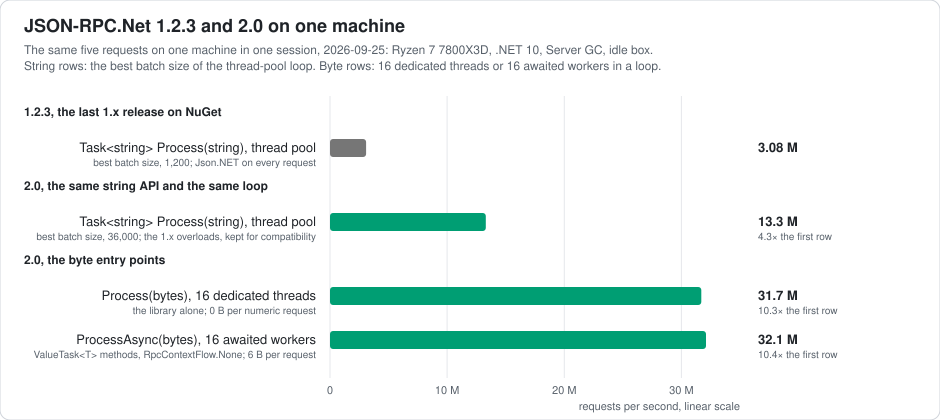
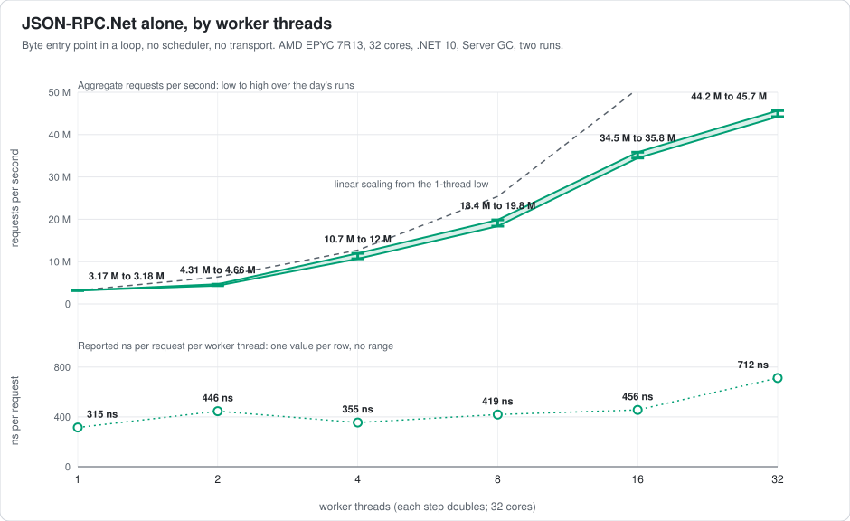
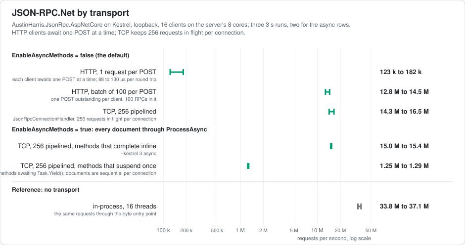
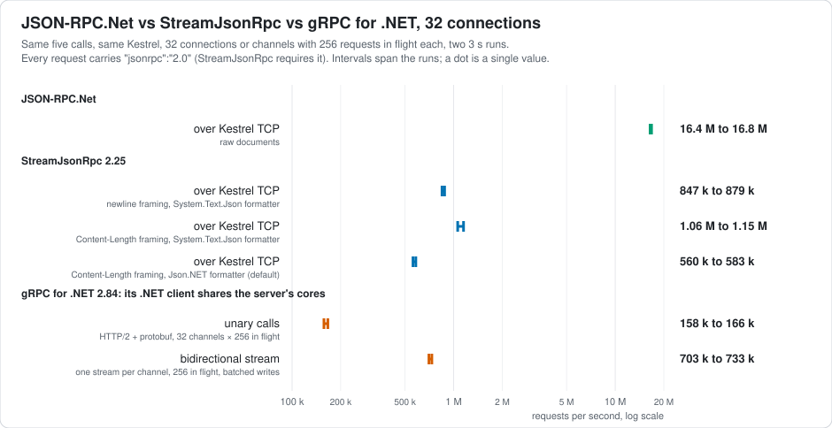
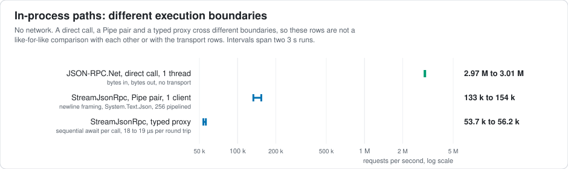
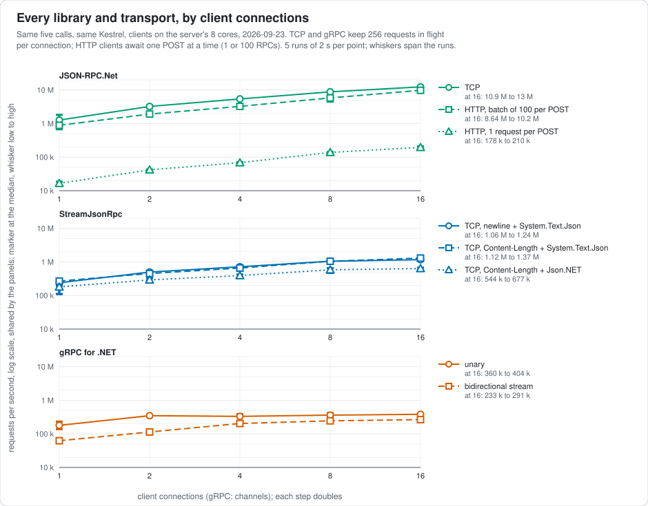

# JSON-RPC.Net

  

JSON-RPC.Net is a [JSON-RPC 2.0](https://www.jsonrpc.org/specification) server for .NET. You give it a request document and it gives you the response document, bytes in and bytes out; the transport is yours. Host it in Kestrel, a console app, sockets, pipes, or a Blazor WebAssembly page.

Version 2.0 rebuilt the pipeline around UTF-8 bytes and made the JSON serializer pluggable. The core depends on no JSON library: Json.NET and System.Text.Json ship as separate packages, and the built-in serializer needs neither. On one core it answers a small request in about 315 ns, with no allocation for numeric parameters. The library alone answers 44.2 M to 45.7 M requests per second on a 32-core cloud host, 24 times what 1.2.3 does on the same machine. Over pipelined TCP, a Kestrel host answers 18.5 M requests per second. [Benchmarks](#benchmarks) gives the method and the full tables.

## Performance

2.0 answers the same five requests 6.0 times faster than 1.2.3 through the 1.x string API and 24.3 times faster through the byte entry points its hosts use (ratios of the medians). The synchronous byte path handles 44.2 M to 45.7 M requests per second on 32 threads of a 32-core Hugging Face Jobs `cpu-performance` host, with no allocation for a numeric request. All results come from the same machine, the same requests and one job; each range is the low and high over that job's runs.

<picture>
  <source media="(prefers-color-scheme: dark)" srcset="benchmarks/charts/headline-1x-vs-2-dark.svg">
  
</picture>

<!-- benchmarks:headline -->
| Path | RPC/s | Against 1.2.3 |
| --- | ---: | ---: |
| 1.2.3, `Task<string> Process(string)`, thread pool, best batch size | 1.29 M to 2.41 M | |
| 2.0, the same string API and the same loop | 9.83 M to 11.1 M | 6.0× |
| 2.0, `Process(bytes)`, 32 dedicated threads | 44.2 M to 45.7 M | 24.3× |
| 2.0, `ProcessAsync(bytes)`, 32 awaited workers | 36.3 M to 40.5 M | 20.7× |

<!-- /benchmarks:headline -->

The request path uses a span tokenizer over the UTF-8 bytes and invokers compiled against the concrete reader and writer. It writes the response straight into a pooled buffer, with no `Task`, result string or continuation per request. A numeric request never touches the GC. Over Kestrel TCP, the AspNetCore package holds 18.5 M with 256 requests in flight per connection. [Benchmarks](#benchmarks) has the full tables, the conditions and the ranges over the job's runs. The [explorer](https://astn.github.io/JSON-RPC.NET/benchmarks/charts/explorer.html) has the exact values. `benchmarks/Baseline` re-runs the 1.2.3 row from NuGet with the same loop as the 2.0 harness.


It is a server only. There are no client proxies and no server-to-client calls. If you need a bidirectional RPC framework, look at [StreamJsonRpc](https://www.nuget.org/packages/StreamJsonRpc); the benchmarks compare the two.

This README and the package guides are also published at [astn.github.io/JSON-RPC.NET](https://astn.github.io/JSON-RPC.NET/). What the library does by default and what it leaves to you is under [Security](#security).

- [Performance](#performance)
- [Packages](#packages)
- [Requirements](#requirements)
- [Installation](#installation)
- [Getting started](#getting-started)
- [Defining methods](#defining-methods)
- [Hosting](#hosting)
- [Errors](#errors)
- [Asynchronous methods and cancellation](#asynchronous-methods-and-cancellation)
- [Sessions and context](#sessions-and-context)
- [Configuration](#configuration)
- [Security](#security)
- [Benchmarks](#benchmarks)
- [Upgrading from 1.x](#upgrading-from-1x)
- [Versioning and support](#versioning-and-support)
- [Building](#building)
- [License](#license)

## Packages

All four packages are MIT licensed and ship together with the same version number.

| Package | What it is |
| --- | --- |
| `AustinHarris.JsonRpc` | The server. Envelope parsing, method dispatch, parameter binding, error mapping, sessions. Ships with the built-in serializer, `JsmnSerializer`: a span port of the [jsmn](https://github.com/zserge/jsmn) tokenizer plus a cached reflection mapper, with no JSON library behind it. |
| `AustinHarris.JsonRpc.Newtonsoft` | Json.NET 13 serializer. The compatibility choice: `JsonSerializerSettings`, `[JsonProperty]`, converters, lenient input. |
| `AustinHarris.JsonRpc.SystemTextJson` | System.Text.Json serializer. `JsonSerializerOptions`, `Utf8JsonReader`/`Utf8JsonWriter` straight on the request bytes. |
| `AustinHarris.JsonRpc.AspNetCore` | Kestrel hosting: an HTTP endpoint on `PipeReader`/`BodyWriter`, a `ConnectionHandler` for raw TCP, Unix socket and named pipe connections, and DI registration of services. |

## Requirements

`AustinHarris.JsonRpc`, `.Newtonsoft` and `.SystemTextJson` target:

| Target | Covers |
| --- | --- |
| `netstandard2.0` | .NET Framework 4.6.1+, .NET Core 2.0+, Mono 5.4+, Xamarin, Unity 2018.1+ |
| `netstandard2.1` | .NET Core 3.0+, Mono 6.4+, Xamarin |
| `net8.0` | .NET 8 (LTS) |
| `net10.0` | .NET 10 (LTS) |

`AustinHarris.JsonRpc.AspNetCore` targets `net8.0` and `net10.0`.

The "Covers" column is what each target framework admits, not what is tested. CI runs the test suite on `net8.0` and `net10.0`; the WebAssembly sample is built in CI and run by hand. The other runtimes can load the `netstandard` assets but are not part of the test matrix. On .NET Framework, 4.7.2 or later avoids the binding redirects that 4.6.1 to 4.7.1 need for `netstandard2.0` libraries.

Dependencies at 2.0.0: none on `net8.0` and `net10.0`; on `netstandard` only, `System.Memory` 4.6.3, and `netstandard2.0` also references `System.Threading.Tasks.Extensions` 4.5.0 for `ValueTask`. The Newtonsoft package depends on Newtonsoft.Json 13.0.4 and the System.Text.Json package on System.Text.Json 10.0.3.

The core uses no reflection emit. The WebAssembly sample runs under the configurations listed in [samples/WasmHost/README.md](samples/WasmHost/README.md); it validates neither `PublishTrimmed` nor `PublishAot`, which are unsupported: services and their `[JsonRpcMethod]` members are found by reflection and the invokers are compiled expression trees.

## Installation

```
dotnet add package AustinHarris.JsonRpc --prerelease
```

2.0 is published as `2.0.0-preview.1`; without `--prerelease`, NuGet resolves to the last 1.x release.

Add `AustinHarris.JsonRpc.Newtonsoft` or `AustinHarris.JsonRpc.SystemTextJson` if you want that serializer, and `AustinHarris.JsonRpc.AspNetCore` to host in Kestrel.

## Getting started

### 1. Declare a service

Save this as `server.cs`. It is a .NET 10 file-based app: one C# file with no project file. The `#:sdk` and `#:package` directives select the web SDK and package. `ServiceBinder.BindMethod` registers the lambdas; Kestrel serves them at `/rpc`.

```csharp
#:sdk Microsoft.NET.Sdk.Web
#:package AustinHarris.JsonRpc.AspNetCore@2.0.0-preview.1

using AustinHarris.JsonRpc;
using AustinHarris.JsonRpc.AspNetCore;

ServiceBinder.BindMethod("add", (double l, double r) => l + r);
ServiceBinder.BindMethod("greet", (string who) => "hello " + who);

var builder = WebApplication.CreateBuilder(args);
builder.Services.AddJsonRpc();

var app = builder.Build();
app.MapJsonRpc("/rpc");
app.Run();
```

Run `dotnet run server.cs`. Kestrel prints the URL it listens on. To use the address below, run `dotnet run server.cs -- --urls http://127.0.0.1:5077`, then send this request from another terminal:

```bash
curl -s -X POST http://127.0.0.1:5077/rpc -H "Content-Type: application/json" -d '{"jsonrpc":"2.0","method":"add","params":[1,2],"id":1}'
```

```json
{"jsonrpc":"2.0","result":3.0,"id":1}
```

On .NET 8, the same code works in `Program.cs` in an ordinary ASP.NET Core project: install the package with `dotnet add package AustinHarris.JsonRpc.AspNetCore --prerelease` and drop the two `#:` lines.

For methods grouped in a class, create `CalculatorService.cs`. Derive from `JsonRpcService` and mark the methods you want to expose with `[JsonRpcMethod]`. Constructing the service registers it, so you only need to keep the instance alive.

```csharp
using AustinHarris.JsonRpc;

public class CalculatorService : JsonRpcService
{
    [JsonRpcMethod]                 // exposed as "add"
    private double add(double l, double r) => l + r;

    [JsonRpcMethod("multiply")]     // exposed under an explicit name
    public int Multiply(int l, int r) => l * r;

    [JsonRpcMethod]
    public string StringMe(string x) => x;
}
```

Methods can be `private`; parameters may be positional (`"params":[1,2]`) or named (`"params":{"l":1,"r":2}`). Optional parameters with default values are honoured, and a parameter's JSON name can be overridden with `[JsonRpcParam("name")]`.

Every method lives in a *session*, a named set of methods. Both examples register methods in the default session (`Handler.DefaultSessionId()`), which is all most applications need. Lambdas and classes can be mixed in one session, but method names must be unique: `BindMethod` throws for a name that is already registered, and a class bound afterwards replaces an earlier registration of the same name. Both examples register `add`, so keep one of them. Overloads that take a `sessionId` let one process serve separate method sets; see [Sessions and context](#sessions-and-context).

The next step drives `CalculatorService` in process, without a transport.

### 2. Process requests

```csharp
using System;
using System.Buffers;
using System.Text;
using AustinHarris.JsonRpc;

var service = new CalculatorService();   // binds itself to the default session; keep a reference

// Strings, asynchronous invocation.
string response = await JsonRpcProcessor.ProcessAsync("""{"jsonrpc":"2.0","method":"add","params":[1,2],"id":1}""");
// {"jsonrpc":"2.0","result":3.0,"id":1}

// Strings, synchronous, on the calling thread. Named parameters.
string sync = JsonRpcProcessor.ProcessSync("""{"method":"multiply","params":{"l":6,"r":7},"id":2}""");
// {"jsonrpc":"2.0","result":42,"id":2}

// Bytes: the native path. The string overloads transcode into it.
var output = new ArrayBufferWriter<byte>();
JsonRpcProcessor.Process(Handler.DefaultSessionId(), """{"method":"add","params":[2,3],"id":3}"""u8, output);
Console.WriteLine(Encoding.UTF8.GetString(output.WrittenSpan));   // nothing is written for a notification
```

Batches (`[{...},{...}]`) and notifications (requests without an `id`) are handled per the spec: a batch answers with an array, a notification produces nothing. The byte overloads take `ReadOnlySpan<byte>`, `ReadOnlyMemory<byte>` or `ReadOnlySequence<byte>`. A `"""..."""u8` literal is a `ReadOnlySpan<byte>` (C# 11 and later). A bare `byte[]` selects the span overload on C# 14 and later; on C# 12 and 13 it is ambiguous between the memory and span overloads, so pass it as `AsSpan()` there.

That is the whole in-process server. The rest of this page is about exposing methods, putting a transport in front, and what happens when things go wrong.

## Defining methods

A *method* is a callable identified by the `method` member of a request; its implementation is a delegate, a `[JsonRpcMethod]` member of a class, or a member of a bound interface. `ServiceBinder` never asks for a `MethodInfo`; the same word names the -32601 "Method not found" error. Names beginning with `rpc.` and the name `$/cancelRequest` are reserved and refused at registration.

### Classes

Any class works, not only `JsonRpcService` subclasses: bind an instance with `ServiceBinder.BindService(sessionId, instance)`. A `JsonRpcService` subclass binds itself to the default session in its parameterless constructor. Write `: base(false)` for a subclass that something else binds (the AspNetCore host binds every registered service to its effective session) and `: base(sessionId)` to bind to another session.

An instance bound with `BindService(sessionId, instance)` serves every request on every thread, so it must be thread-safe. `BindService(sessionId, typeof(T), resolve)` binds a type instead: right before each call the resolver is handed the RPC context and returns the instance to invoke, which is how a container's scoped and transient lifetimes reach a method (the AspNetCore package does this for `AddJsonRpcService<T>(ServiceLifetime.Scoped)`; see [Kestrel HTTP endpoint](#kestrel-http-endpoint)). The core takes no dependency on any container: the resolver is a plain delegate, so Microsoft.Extensions.DependencyInjection, Autofac and a hand-written factory all fit. Static methods never resolve.

### Delegates

Bind a delegate as a JSON-RPC method with `ServiceBinder.BindMethod`; a lambda keeps its parameter names for named params:

```csharp
ServiceBinder.BindMethod("add", (double l, double r) => l + r);
ServiceBinder.BindMethod("greet", (string who) => "hello " + who);                            // {"method":"greet","params":{"who":"you"}}
ServiceBinder.BindMethod(sessionId, "scale", (double v, double f) => v * f,
    parameterNames: new[] { "value", null }, defaults: new Dictionary<string, object> { ["f"] = 10 });
ServiceBinder.UnbindMethod("add");
```

A name already registered on the session is an error (unbind it first); a delegate whose parameter names cannot be recovered (a closed delegate created with `Delegate.CreateDelegate`) gets `arg1`, `arg2`, ... unless you pass names. `Task` and `ValueTask` delegates are served by `ProcessAsync`; see [Asynchronous methods and cancellation](#asynchronous-methods-and-cancellation).

### Interfaces

An interface can define the exposed contract, including a tree of interface-typed properties. Implementation-only methods stay private to the host; parameter names, `[JsonRpcParam]`, aliases and optional defaults come from the interface:

```csharp
public interface IWorld { ICharacter Character { get; } IAdmin Admin { get; } }
public interface ICharacter { void MoveAndRotate(float distance, float roll = 0, int ticks = 1); }
public interface IAdmin { ICharacter Character { get; } }

RpcBinding binding = ServiceBinder.BindInterface<IWorld>(sessionId, world);
// Character.MoveAndRotate and Admin.Character.MoveAndRotate
binding.Dispose(); // unbinds this tree, leaving later replacements alone

using var characterOnly = ServiceBinder.BindInterface<IWorld>(sessionId, world,
    new RpcInterfaceBindingOptions { Include = m => m.Path.Length == 1 });
// Include can also inspect m.MethodInfo for the host's own interface attributes.
```

Each interface-typed property becomes a name segment, so `IWorld.Character.MoveAndRotate` is exposed as `Character.MoveAndRotate`. The whole tree is walked and compiled when you call `BindInterface`, so a request pays nothing for it.

What happens at registration:

- Each property getter runs once, and the object it returns is the one that serves calls. Setting the property later changes nothing. A getter may have side effects; they happen once and are not undone if registration fails.
- Registration is all or nothing. It throws, exposing no method, on an empty or duplicate name, a name starting with `rpc.`, a name already bound in the session, a null or throwing getter, a cycle, or a path deeper than 32 properties.
- Inherited members, explicit implementations and closed generic interfaces are supported. Generic methods and default interface method bodies are rejected.

Naming, through `RpcInterfaceBindingOptions`:

| Option | Default | Effect |
| --- | --- | --- |
| `Recursive` | `true` | `false` binds only the root interface's methods |
| `Prefix` | `""` | prepended to every generated name |
| `Separator` | `"."` | joins property segments and the method name |
| `Casing` | `Preserve` | `CamelCase` lower-cases the first letter of each generated segment (invariant culture) |
| `Include` | all | a predicate over `RpcInterfaceMethod` (`Path`, `MethodInfo`, `Interface`, `Leaf`, `DefaultName`) |
| `NameRule` | none | returns the complete wire name, replacing the rules above |

An explicit `[JsonRpcMethod("alias")]` on an interface method is used as written. `Task` and `ValueTask` members are served by `ProcessAsync`; `[JsonRpcMethod(ContextFlow = RpcContextFlow.Flow)]` on the interface member opts into context flow across awaits (see [Asynchronous methods and cancellation](#asynchronous-methods-and-cancellation)).

`BindInterface` returns an `RpcBinding`. Disposing it unbinds exactly this tree (not a later registration under the same names), is safe to call twice, and does not dispose your objects. Calls already dispatched finish on the implementation they started with.

## Hosting

The core is transport-agnostic. Pick whichever of these fits, or build your own on the byte entry point.

### In-process (strings or bytes)

Call the processor yourself, as in [Getting started](#getting-started). The byte overloads take what a `PipeReader` gives you (`ReadOnlySequence<byte>`) and write to any `IBufferWriter<byte>`: a `PipeWriter`, a socket buffer or `HttpResponse.BodyWriter`. Nothing is written for a notification, so check `output.WrittenCount` before sending. If your transport carries several documents per connection, `JsonFramer.TryReadDocument` cuts complete documents out of the byte stream without parsing them.

A host that owns its transport also owns the deadline (the core has none; see [Deadlines](#asynchronous-methods-and-cancellation)). Link a `CancellationTokenSource` to the connection's lifetime token, arm it with `CancelAfter` and pass its token to `ProcessAsync` and to the write of the reply. When the budget expires, abort the transport at once, but still await the call: `ProcessAsync` completes only after the running method has terminated, a cancelled call commits no response bytes, and until the await returns the request memory and the output writer belong to the call, so neither goes back to a pool or is reused before then.

```csharp
// One request document on a connection the host owns: `rented` came from ArrayPool<byte>.Shared,
// `transport` is the connection's stream, `lifetime` is cancelled when the connection closes.
static async Task ServeDocumentAsync(string sessionId, byte[] rented, int length, Stream transport,
    CancellationToken lifetime)
{
    var output = new ArrayBufferWriter<byte>();
    using var deadline = CancellationTokenSource.CreateLinkedTokenSource(lifetime);
    deadline.CancelAfter(TimeSpan.FromSeconds(5));
    // When the budget expires, abort the transport at once, even while a method is still running.
    using var abort = deadline.Token.Register(static s => ((Stream)s!).Dispose(), transport);
    try
    {
        await JsonRpcProcessor.ProcessAsync(sessionId, new ReadOnlyMemory<byte>(rented, 0, length), output,
            context: transport, serializer: null, cancellationToken: deadline.Token);
    }
    catch (OperationCanceledException)
    {
        return;   // the call has terminated and wrote no response bytes
    }
    finally
    {
        // Only now that the awaited call has returned may the input go back to the pool
        // (or the output be reused): until then the processor may still read and write them.
        ArrayPool<byte>.Shared.Return(rented);
    }
    if (output.WrittenCount > 0)   // nothing is written for a notification
        await transport.WriteAsync(output.WrittenMemory, deadline.Token);
}
```

### Kestrel HTTP endpoint

```csharp
using AustinHarris.JsonRpc.AspNetCore;

var builder = WebApplication.CreateBuilder(args);
builder.Services.AddJsonRpc();
builder.Services.AddJsonRpcService<CalculatorService>();   // built by DI; any class with [JsonRpcMethod] works

var app = builder.Build();
app.MapJsonRpc("/rpc");                                    // POST /rpc; compose with RequireAuthorization() etc.
app.Run();
```

A request or batch answers `200 application/json`; a notification answers `204`. The body goes from `PipeReader` to `BodyWriter` without becoming a string. Inside a method, `JsonRpcContext.Current().Value` is the `HttpContext`.

`AddJsonRpcService<T>()` registers `T` as a singleton: resolved once from the root container when the host starts, one instance for every request on every thread, so it must be thread-safe and cannot take scoped dependencies such as an EF Core `DbContext` (a singleton uses `IDbContextFactory<T>`, or captures `((HttpContext)Handler.RpcContext()).RequestServices` before its first `await`). `AddJsonRpcService<T>(ServiceLifetime.Scoped)` (or `Transient`) resolves `T` per call from the request's provider instead: `HttpContext.RequestServices` on HTTP, a scope the raw connection handler opens and disposes per document. A `DbContext` then goes in the constructor as usual, every call of a batch shares one scope, and a transient is created per call. A lifetime that disagrees with an existing registration of `T` is refused, at registration or at startup. To await `Task` and `ValueTask` methods, set `o.EnableAsyncMethods = true` in `AddJsonRpc`; the request is then cancelled when the client disconnects (`RequestAborted`). The other options (session per request, serializer, body size limit, content type) and the per-endpoint overload `MapJsonRpc(pattern, options)` are in the [package README](AustinHarris.JsonRpc.AspNetCore/README.md).

### Kestrel raw connections (TCP, Unix socket, named pipe)

```csharp
builder.WebHost.ConfigureKestrel(k =>
{
    k.ListenLocalhost(9000, l => l.UseConnectionHandler<JsonRpcConnectionHandler>());
    // k.ListenUnixSocket("/tmp/rpc.sock", l => l.UseConnectionHandler<JsonRpcConnectionHandler>());
    // k.ListenNamedPipe("rpc", l => l.UseConnectionHandler<JsonRpcConnectionHandler>());
});
```

Clients write JSON documents back to back (whitespace or newlines between them are fine) and read the responses in the same order, also back to back with no separator; notifications produce nothing. The framer accepts strict JSON only, so single-quoted strings and other lenient syntax are refused on a raw connection even with the Json.NET serializer.

A raw connection has no authentication, authorisation or rate limiting; those are HTTP middleware and do not run here. Listen on loopback or a Unix socket, or put something in front that authenticates. A document larger than `MaxRequestBytes` (4 MB) aborts the connection. The core applies its own `JsonRpcLimits` to the document the host hands over, so the transport limit is met first and the core limit second.

With `EnableAsyncMethods = true`, documents on one connection are processed one at a time in order, and replies already finished are flushed before the connection waits on a slow method. Separate connections run concurrently.

### Blazor WebAssembly

The core runs inside the browser. [samples/WasmHost](samples/WasmHost) is a Blazor WebAssembly app where JavaScript hands a request document to a `[JSExport]`/`[JSInvokable]` method that calls the processor and returns the response, with no HTTP involved. The same service class then serves both the browser and the server. The sample page also benchmarks JSON-RPC against plain Blazor interop; the numbers are in its README.

### Classic ASP.NET (System.Web)

`AustinHarris.JsonRpc.AspNet` is a 1.x package and is not part of 2.0. It targets .NET Framework 4.0, and the 2.0 core needs `netstandard2.0` (.NET Framework 4.6.1 or later), so the two cannot be combined. To host in System.Web on 2.0, call `JsonRpcProcessor.ProcessSync` from your own `IHttpHandler`.

## Errors

### Exception disclosure

By default (`Config.IncludeExceptionDetails = false`), an unhandled exception thrown by a method, or thrown while its result is written, becomes `-32603 Internal Error` with `data: null`. Nothing about the exception leaves the process: not its type name, not its message. The redaction happens when the response is written, after the error handler ran, so a handler still sees the original `Exception` in `data` and can decide what the client gets instead:

```csharp
Config.SetErrorHandler((request, error) =>
    error.data is Exception ex ? new JsonRpcException(-32000, "Server error", Log(ex)) : error);
```

Set `Config.IncludeExceptionDetails = true` only for trusted development clients: `data` then carries the full `ExceptionInfo` (`ClassName`, `Message`, `Source`, `StackTraceString`, `HResult` and the `InnerException` chain).

A `JsonRpcException` thrown by the application, or returned by an error handler, keeps the `data` it was given; that data is authored, not redacted.

### Handlers

Throw `JsonRpcException(code, message, data)` to return an error of your own. To reshape errors, or to inspect requests on the way in and out, register handlers. Each handler belongs to one session:

```csharp
// Default session
Config.SetErrorHandler((request, exception) => new JsonRpcException(-32000, "Server error", exception.data));
Config.SetParseErrorHandler((rawJson, exception) => exception);
Config.SetPreProcessHandler((request, context) => null);              // return a JsonRpcException to reject; may replace Method/Params/Id
Config.SetPostProcessHandler((request, response, context) => null);   // return a JsonRpcException to replace the result

// Another session: other sessions do not inherit the default session's handlers
Config.SetErrorHandler("client-42", (request, exception) => exception);
Config.SetParseErrorHandler("client-42", (rawJson, exception) => exception);
Config.SetPreProcessHandler("client-42", (request, context) => null);
Config.SetPostProcessHandler("client-42", (request, response, context) => null);
```

The overloads without a session id set the **default session's** handler, not a process-wide one; the overloads with a session id create the session when it does not exist yet, and a null handler clears only that session's. A pre- or post-process handler moves its session onto a slower path, which builds `JsonRequest` and `JsonResponse` objects for the handler to see. Leave them unset unless you need them. (`Config.SetBeforeProcessHandler(sessionId, …)`, the 1.x name, still works and is marked obsolete.)

### Error codes

The errors the library raises itself carry structured `data`, identical for every serializer, and the error handler receives the same object:

| Code | `error.data` | Object seen by the error handler |
| --- | --- | --- |
| `-32601` Method not found | `{"method":"<name as requested>"}` | `MethodNotFoundInfo` |
| `-32600` Invalid Request: the document or batch exceeds a configured limit | `{"limit":"maxDocumentBytes","maximum":4194304}` or `{"limit":"maxBatchCount","maximum":1024}` (the configured maximum) | `LimitExceededInfo` |
| `-32602` Invalid params: count, missing, unknown or repeated named parameter | a sentence, e.g. `"Named parameter 'b' was not present."` | `string` |
| `-32602` Invalid params: a value the serializer could not convert | `{"reason":"conversion","parameter":"b","index":1,"expectedType":"int32"}` plus `"message"` when `Config.IncludeExceptionDetails` is on; the value sent is never echoed | `ParameterErrorInfo` (with the serializer's exception in `Cause`) |
| `-32603` Internal error: the method threw, its result could not be written, or a parameter's type is one the serializer cannot handle | `null`, or the full `ExceptionInfo` when `Config.IncludeExceptionDetails` is on, see [Exception disclosure](#exception-disclosure) | `Exception` |

In the second `-32602` row, "could not convert" means the serializer refused the value (`JsonRpcBindException`, `FormatException`, `OverflowException`, `InvalidCastException`, or any `JsonException` from System.Text.Json or Json.NET); what each serializer accepts (say `"7"` for an `int`) is its own decision, see [docs/serializers.md](docs/serializers.md).

## Asynchronous methods and cancellation

A method may return `Task`, `Task<T>`, `ValueTask` or `ValueTask<T>`. Call it through `JsonRpcProcessor.ProcessAsync`. The processor awaits the method and writes its result; `Task` and `ValueTask` answer `null`. A method that completes synchronously runs inline and the byte overloads then return `Task.CompletedTask`.

**Cost.** With `RpcContextFlow.None`, the built-in numeric fast path adds no dispatcher allocation when the invocation completes inline. The service's own allocations (a `Task.FromResult`, a result string) are separate and included in the harness figures. Flow allocates an `InvocationState` even when the call completes inline. A method that suspends may allocate its own async state plus completion state in the result writer, the request handler and the document processor. The yielding benchmark measured 548 B per request under None at one worker (the median of two runs on 2026-09-28), including the service's allocations. A suspension also costs a continuation per request. The figures are in [Async](#async-processasync-awaited-workers).

```csharp
[JsonRpcMethod("lookup")]
public async Task<Item> Lookup(int id, [JsonRpcCancellation] CancellationToken cancellationToken)
    => await repository.FindAsync(id, cancellationToken).ConfigureAwait(false);

await JsonRpcProcessor.ProcessAsync(sessionId, requestMemory, output,
    context: requestContext, cancellationToken: cancellationToken);
string response = await JsonRpcProcessor.ProcessAsync(sessionId, requestJson,
    context: requestContext, cancellationToken: cancellationToken);
```

**Which entry point to use.** `ProcessAsync` is the only entry point that awaits. `Process` and `ProcessSync` answer an async method with `-32603` and a message pointing to `ProcessAsync`, and do not call it. The older `Task<string> Process(…)` overloads run the synchronous path on the thread pool through `Task.Factory.StartNew`; despite returning a `Task`, they do not await async methods either.

**Deadlines.** The server defines no per-call deadline and no client-supplied deadline member. On HTTP, configure the ASP.NET Core request-timeouts middleware (`AddRequestTimeouts`, `UseRequestTimeouts`, `WithRequestTimeout`) on the endpoint; its budget covers the whole HTTP request including a batch, it is observed only with `EnableAsyncMethods = true` (the synchronous endpoint path passes no token), and only by `[JsonRpcCancellation]` parameters and by the processor between and after batch elements, so a completed result can be discarded without the method having observed a token. Raw and in-process hosts own their lifetime tokens; application methods own finer operation budgets. Cancellation is cooperative: the library waits for running methods and does not undo their effects. A host that owns its transport enforces a deadline itself; [In-process (strings or bytes)](#in-process-strings-or-bytes) shows one.

**Order.** A batch runs one request at a time, in order. Notifications are awaited like any other request.

**Cancellation.** To receive the processor's token, a method declares a `CancellationToken` parameter marked `[JsonRpcCancellation]`. That parameter never binds from JSON and is left out of the SMD. A `CancellationToken` parameter without the attribute is rejected at registration. A synchronous method called through `ProcessAsync` receives the token too; through `Process` and `ProcessSync` it receives the default token. When the token fires:

- the processor checks it before each invocation, between batch elements, and before writing the response;
- a method already running is waited for, not abandoned, so a method that ignores the token delays cancellation;
- nothing is written to `output`, the returned task is cancelled, and whatever the method already did stays done.

An `OperationCanceledException` that a method throws while the processor's token has not fired is an ordinary error.

**Buffers.** The byte overloads accept `ReadOnlyMemory<byte>`, `ReadOnlySequence<byte>` or `ReadOnlySpan<byte>`. The span overload and segmented sequences are copied before the first await. For memory you pass in, keep the request bytes unchanged and the output writer to yourself until the task completes. No output span is held across an await. The task finishes when the response is written, not when your transport has flushed it.

**Ambient context after an await.** `Handler.RpcContext()`, `Handler.RpcRequestId()`, `JsonRpcContext.Current()` and `Handler.RpcSetException()` work in an async method only up to its first real await. That default, `RpcContextFlow.None`, allocates nothing. Read what you need at the top of the method:

```csharp
[JsonRpcMethod("lookup")]
public async Task<Item> Lookup(int id)
{
    var http = (HttpContext)Handler.RpcContext();        // before the first await
    JsonRpcRequestId requestId = Handler.RpcRequestId();  // an owned copy, safe to keep
    var item = await repository.FindAsync(id);
    if (item == null) throw new JsonRpcException(-32000, "Not found", null);
    return item;
}
```

If a method needs the accessors after awaiting, opt it into `RpcContextFlow.Flow`. The accessors then work across sequential awaits and nested dispatch, and every invocation pays one allocation for the execution-context bridge, completed tasks included:

```csharp
[JsonRpcMethod(ContextFlow = RpcContextFlow.Flow)]
public async Task<Item> Lookup(int id)
{
    var item = await repository.FindAsync(id);
    if (item == null) Handler.RpcSetException(new JsonRpcException(-32000, "Not found", null));
    return item;
}

ServiceBinder.BindMethod(sessionId, "lookup", new Func<int, Task<Item>>(LookupAsync),
    contextFlow: RpcContextFlow.Flow);
```

In either mode, give parallel branches and background work their own copies of the context and request id, because the ambient state is cleared when the call finishes. Use `Handler.RpcRequestIdRaw()` only in the statement that reads it.

**Rejected at registration:** `async void`, custom awaitables, a `Task` that returns a `Task`, `IAsyncEnumerable<T>`, and `ref`/`out` parameters on async methods (including the legacy trailing `ref JsonRpcException`). A method that returns a null `Task` is answered with `-32603`.

Work that should outlive the request is better served by a job ticket:

```csharp
[JsonRpcMethod] private string startExport(string filter) { var job = Jobs.Start(() => ExportAsync(filter)); return job.Id; }
[JsonRpcMethod] private ExportStatus exportStatus(string jobId) => Jobs.Status(jobId);
```

The client gets a ticket immediately and polls, or the transport pushes a notification when the job finishes.

## Sessions and context

A *session* is a named set of JSON-RPC methods with its own configuration, stored in a process-wide registry until explicitly destroyed; it has no connection lifetime of its own and no relationship to ASP.NET Core session state. Sessions let you host independent sets of methods, for example one per connected client or tenant:

```csharp
ServiceBinder.BindService("client-42", new CalculatorService());   // any object with [JsonRpcMethod] members
string response = await JsonRpcProcessor.Process("client-42", request, context);
Handler.DestroySession("client-42");
```

Sessions are stored in a process-wide registry. Binding (`ServiceBinder.BindService`, `BindMethod`, `BindInterface`, a `JsonRpcService` constructor), the per-session `Config` setters and `Handler.GetSessionHandler(sessionId)` create a session; it remains until `Handler.DestroySession(sessionId)` is called. A request for a session id that was never registered creates nothing: every call in it answers `-32601` and the default session's methods are not reachable through it, so an id taken from a route or header cannot grow the registry. Each registration or destruction makes every thread refresh its copy of the registry on its next lookup, so register at startup or when a connection or tenant appears, not per request, and destroy tenant- or connection-scoped sessions when their lifetime ends.

### What sessions are for

A session is an independent method table with its own serializer, `jsonrpc` version policy and handlers, chosen per request by its id. That covers:

- **API versions.** Bind `v1` and `v2` as two sessions with different method names or parameter contracts and serve both at once.
- **Tenants.** Bind the same class once per tenant, each session over its own instance, and give some tenants methods the others do not have.
- **Connections.** Bind a session when a client connects and destroy it when the client disconnects, so its methods live exactly as long as the connection.
- **Capability sets.** Offer a small public session and a larger administrative one instead of a mode flag inside every method.
- **Migration and experiments.** Route selected clients to a session bound to a new implementation of the same method names while the rest keep the established one.
- **Wire compatibility.** Set the serializer, version policy and error handlers per session for clients with different expectations.
- **Several surfaces in one process.** An embedded host runs independent method sets side by side, even over one transport: the Kestrel HTTP endpoint picks the session per request through `JsonRpcOptions.SessionSelector`.

### Rough edges

- **Authorisation.** A session id is routing, not a permission. When it selects tenant data or privileged methods, the host decides which id a caller may name; the library guarantees only that an unknown id reaches nothing.
- **Lifetime.** A session stays in the registry until `Handler.DestroySession(sessionId)`. Connection- and tenant-scoped sessions need cleanup the host can rely on, such as a disconnect callback.
- **Registration cost.** Each registration or destruction makes every thread refresh its view of the registry on its next lookup, so a session per request is the wrong shape; a session per connection or tenant is fine.
- **Shared instances.** `BindService(sessionId, instance)` hands the same object to every concurrent call, so it must be thread-safe and must not keep request state in fields. `BindService(sessionId, typeof(T), resolve)` and `AddJsonRpcService<T>(ServiceLifetime.Scoped)` give each call its own instance; see [Classes](#classes).
- **The default session.** A `JsonRpcService` subclass built with the parameterless constructor binds to the default session, and a handler setter on `Config` without a session id changes the default session's handler.
- **Compatibility.** Two versions can expose different signatures, but an old result shape or old semantics still needs its own implementation or an adapter.
- **Configuration scope.** A session is not a whole server: exception disclosure is process-wide and the serializer can also be chosen per call; the scopes are listed under [Configuration](#configuration).

### Context

Pass an arbitrary context object through to your methods and read it with `Handler.RpcContext()` or `JsonRpcContext.Current().Value` (the AspNetCore package passes the `HttpContext` or `ConnectionContext`):

```csharp
await JsonRpcProcessor.Process(request, context: httpContext);

[JsonRpcMethod]
private string WhoAmI() => ((HttpContext)Handler.RpcContext()).User.Identity.Name;
```

### The request id

The request's `id` is available the same way, read on demand from the request bytes, so a method that never asks pays nothing:

```csharp
[JsonRpcMethod]
private string Track()
{
    JsonRpcRequestId id = JsonRpcContext.CurrentRequestId();   // or Handler.RpcRequestId(): an owned snapshot, keep it anywhere
    if (id.TryGetInt64(out long n)) { /* integer id */ }
    string text = id.GetString();                               // string ids (decoded); null otherwise
    string digits = id.GetIntegerText();                        // integers, including ones wider than Int64
    JsonRpcIdKind kind = Handler.RpcRequestIdKind();            // Integer, String, Null, or Absent for a notification
    ReadOnlySpan<byte> raw = Handler.RpcRequestIdRaw();         // the id's JSON as sent (`12`, `"abc"`, `null`); a borrow, use it before returning
    return id.ToString();
}
```

`JsonRpcRequestId` is a small struct you own: keep it anywhere. An integer id allocates nothing, a string id allocates its decoded string, and `RpcRequestIdRaw()` never allocates but is only valid until the method returns. If a method dispatches another request through `JsonRpcProcessor`, the inner method sees the inner id, and the outer id comes back afterwards. A pre-process handler that replaces `JsonRequest.Id` changes the id the method sees. A method parameter called `id` is unrelated: it binds from `params` like any other.

After an `await`, these accessors follow the rules in [Asynchronous methods and cancellation](#asynchronous-methods-and-cancellation).

## Configuration

Settings live on `Config`. They do not all reach every scope:

| Setting | Per call | Per session | Process-wide |
| --- | --- | --- | --- |
| Serializer | `serializer` argument | `Config.SetSerializer(sessionId, …)` | `Config.SetSerializer(…)` / `Config.Serializer` |
| `jsonrpc` version policy | | `Config.SetVersionPolicy(sessionId, …)` | `Config.VersionPolicy` |
| Exception details | | | `Config.IncludeExceptionDetails` |
| Error, parse-error, pre- and post-process handlers | | `Config.Set…Handler(sessionId, …)` (see [Handlers](#handlers)) | no: the overloads without a session id set the **default session's** handler |

Where more than one scope applies, the narrowest one wins. Context and cancellation are supplied per call.

### Serializer

```csharp
// Process-wide
Config.SetSerializer(new SystemTextJsonRpcSerializer(new JsonSerializerOptions { PropertyNamingPolicy = JsonNamingPolicy.CamelCase }));

// Per session
Config.SetSerializer("legacy-clients", new NewtonsoftJsonRpcSerializer(new JsonSerializerSettings { NullValueHandling = NullValueHandling.Ignore }));

// Per call
string json = JsonRpcProcessor.ProcessSync(sessionId, request, context, serializer);
```

The built-in serializer is the default. All three serializers write the envelope, primitives, dates and plain objects the same way (member order, `.0` on whole floats, ISO dates, nulls written), and the test suite runs its protocol cases against each of them. They are not interchangeable for every request: the coercions they accept, the CLR types they support and the object model they hand to handlers differ, so test client-visible requests and responses before switching. Library options go into the serializer's constructor and nowhere else:

| Serializer | Constructor | Notes |
| --- | --- | --- |
| built-in | `new JsmnSerializer(lenient: false, maxDepth: 64)` | `lenient` accepts `'single quotes'`, unquoted keys and trailing commas |
| Json.NET | `new NewtonsoftJsonRpcSerializer(settings)` | one `JsonSerializer` is built from the settings and reused; input is always lenient |
| System.Text.Json | `new SystemTextJsonRpcSerializer(options)` | the package adds its wire-format converters to a copy of your options when they are missing |

The full contract, what the core fixes versus what a serializer decides, is in [docs/serializers.md](docs/serializers.md).

### Limits

```csharp
Config.SetLimits(new JsonRpcLimits(maxDocumentBytes: 8 * 1024 * 1024, maxBatchCount: 2048));
Config.SetLimits("legacy-clients", JsonRpcLimits.Unlimited);
```

Zero disables either bound; `JsonRpcLimits.Unlimited` disables both. A null per-session value inherits the process-wide limits.

### Nesting depth

Every serializer exposes `MaxDepth` (default 64). A request nested deeper is answered `-32700` before any handler or binding runs, so recursive parameter conversion is bounded by the same number the JSON library itself enforces: the built-in serializer's constructor argument, `JsonSerializerOptions.MaxDepth`, or `JsonSerializerSettings.MaxDepth`.

### The `jsonrpc` member

```csharp
Config.VersionPolicy = JsonRpcVersionPolicy.Lenient;          // process default
Config.SetVersionPolicy("strict-clients", JsonRpcVersionPolicy.Strict);   // per session; null follows the process default
```

| Policy | Missing member | `"2.0"` | Anything else |
| --- | --- | --- | --- |
| `Lenient` (default) | accepted | accepted | `-32600 Invalid Request` |
| `Ignore` | accepted | accepted | accepted |
| `Strict` | `-32600 Invalid Request` | accepted | `-32600 Invalid Request` |

The default keeps tool harnesses that omit the member working while a client speaking another version is told so. `Ignore` is for talking to anything at all.

## Security

What the library does by default:

- **Exception details are off.** An unhandled exception reaches the client as `-32603` with `data: null`: no type name, no message. `Config.IncludeExceptionDetails = true` sends the type, message, stack trace, source, HResult and inner exceptions; use it in development only. See [Exception disclosure](#exception-disclosure).
- **Rejected values are not echoed.** A `-32602` conversion error names the parameter and the expected type, never the value sent.
- **Nesting is limited to 64 levels.** A deeper request is `-32700` before any of your code runs.
- **Document and batch size are limited.** The core rejects a document over `JsonRpcLimits.MaxDocumentBytes` (4 MiB by default) or a batch with more than `MaxBatchCount` entries (1024) with `-32600` and a `data` object naming the limit, before anything is parsed or executed; `Config.SetLimits` changes them, `JsonRpcLimits.Unlimited` disables them. The Kestrel host also bounds bytes while receiving (`MaxRequestBytes`, 4 MB: HTTP answers `413`, a raw connection is aborted), so the first applicable limit wins. There is no response-size limit and no request deadline; a batch runs sequentially, so a batch of small requests ties up one request's worth of server time for all of them.
- **Every `[JsonRpcMethod]` is callable.** Visibility does not matter (private methods are exposed), and `AddJsonRpcServicesFromAssembly` exposes every class in the assembly that carries the attribute.
- **Requests do not create sessions.** An unknown session id answers `-32601` and leaves the registry alone; sessions are created by binding and by the per-session `Config` setters, and live until destroyed; see [Sessions and context](#sessions-and-context).
- **Cancellation is cooperative.** It waits for a running method and cannot undo what the method already did.

What it leaves to you:

Authentication, connection identity, TLS, rate limiting, request logging and deadlines belong to the host. HTTP hosts use ASP.NET Core middleware and endpoint metadata (`RequireAuthorization`, `UseRateLimiter`, the request-timeouts middleware); raw connections bypass that pipeline, so listen on loopback or a Unix socket, authenticate in front of them and use listener limits. Methods enforce authorisation that depends on parameter values. Core limits constrain admitted documents and batches, while transports bound bytes during receipt. Authentication and credential handling remain application responsibilities.
- **Service state.** One service instance serves every request concurrently; see [Classes](#classes).

The `jsonrpc` member policy (`Lenient` by default) is a compatibility setting, not a control; see [The `jsonrpc` member](#the-jsonrpc-member).

## Benchmarks

<!-- benchmarks:summary -->
| What | API and mode | RPC/s | Details |
| --- | --- | ---: | --- |
| Library alone, 32 threads | `Process(bytes)`, dedicated threads | 44.2 M to 45.7 M | [Sync](#sync-the-library-alone) |
| Library alone, 32 workers | `ProcessAsync(bytes)`, awaited workers, methods that complete inline | 26.7 M to 40.5 M | [Async](#async-processasync-awaited-workers); the spread is across registrations, not runs |
| Library alone, 32 workers, one real suspension per request | `ProcessAsync(bytes)`, `yieldsOnce` | 2.55 M | |
| Kestrel TCP, 256 pipelined | `EnableAsyncMethods = false` | 18.5 M | [Kestrel](#kestrel-through-the-aspnetcore-package) |
| Kestrel TCP, 256 pipelined | `EnableAsyncMethods = true`, methods that complete inline | 17 M to 17.1 M | |
| Kestrel TCP, 256 pipelined | `EnableAsyncMethods = true`, methods that suspend once | 2.86 M to 2.87 M | |
| Kestrel HTTP, batch of 100 per POST | `EnableAsyncMethods = false` | 14.4 M to 14.8 M | |
| Kestrel HTTP, one request per POST | `EnableAsyncMethods = false` | 156 k to 162 k | HTTP/1.1 round trips dominate |
| Legacy string API, thread pool | `Task<string> Process(string)`, batches of 6,000 | 9.83 M to 11.1 M | [Legacy](#legacy-string-api-scheduled-synchronous-execution); the 1.x overloads, not the byte path |

<!-- /benchmarks:summary -->

Every table, chart and figure in this section except the WebAssembly one comes from one Hugging Face Jobs run on a `cpu-performance` host: AMD EPYC 7R13, 32 cores (a cgroup quota of all 32 of the host's CPUs), Ubuntu 24.04.5 LTS, .NET 10.0.12, Release, Server GC, with the built-in serializer. The job ran `benchmarks/hf/run.sh <commit> publish` on 2026-09-28 (job 6ab9b3936b030d633f69b0fb, commit 6c3c272): the scaling gate once, three runs of the `t` entry, two of every other mode and of `benchmarks/Baseline`, and five of `--sweep`, one after another. Throughput ranges are the low and high over those runs, and a single figure is one that every run rounded to; the [explorer](https://astn.github.io/JSON-RPC.NET/benchmarks/charts/explorer.html) also has the median and every run. The summary's inline Async range spans the registrations as well as the runs. Each Sync ns figure is the median of the runs' reported costs. The WebAssembly results are a browser measurement on a desktop from 2026-09-23; see the sample's README.

`TestServer_Console` is the benchmark harness. It binds one service with five small methods (`add`, `addInt`, `NullableFloatToNullableFloat`, `Test2`, `StringMe`), drives the same five requests through the server, checks every response is a `result` rather than an error, and ends each mode with a bar chart of RPC/s. For one-request timings with an allocation column, the numbers to check before merging a change to the dispatch path, see [benchmarks/Micro](benchmarks/Micro/README.md).

```
dotnet run -c Release --project TestServer_Console -- --sync 3      # library only, 1..N threads (add a thread count, e.g. --sync 3 1, for one row)
dotnet run -c Release --project TestServer_Console -- --async 3 32  # ProcessAsync from 32 awaited workers (the job host's core count), one row per registration (--async 3 1 for the 1-worker column)
dotnet run -c Release --project TestServer_Console -- --scale 3 32 4.0   # release gate: ProcessAsync must scale at least 4x from 1 to 32 workers (default: the core count), then per-serializer diagnostics (--no-diagnostics skips them)
dotnet run -c Release --project TestServer_Console -- --kestrel 3   # through the AspNetCore package, HTTP and TCP (add `async` for EnableAsyncMethods = true)
dotnet run -c Release --project TestServer_Console -- --compare 3   # the same calls through StreamJsonRpc and gRPC for .NET, side by side
dotnet run -c Release --project TestServer_Console -- --sweep 2 benchmarks/charts/sweep.json   # every library and transport at 1, 2, 4, ... connections up to the core count; one file per run
dotnet run -c Release --project TestServer_Console                  # menu: Enter = Process(bytes), a = ProcessAsync(bytes), t = legacy string API, k = Kestrel, x = compare, q = quit
dotnet run -c Release --project benchmarks/Baseline                 # the last 1.x release (1.2.3 from NuGet) through the same loop as the t entry
dotnet run --project samples/WasmHost                               # browser: "Run benchmark" on the page
```

The three modes measure different things and are named for the entry point they call. `Process(bytes), dedicated threads` measures the library alone. `ProcessAsync(bytes), awaited workers` measures the entry point an asynchronous host calls. `Legacy Process(string), scheduled synchronous work` measures the 1.x string overloads through the thread pool. The Kestrel rows say whether `EnableAsyncMethods` was on.

On Hugging Face Jobs, run `benchmarks/hf/launch.sh <ref> <flavor> [runs|publish]` (`<ref>` is a branch, tag or commit) and retrieve JSON with `benchmarks/hf/fetch.py <job id> <out dir>`; `cpu-upgrade` is 8 vCPU ($0.03/h), `cpu-xl` is 16 vCPU ($1/h), and `cpu-performance` is 32 vCPU ($1.90/h), while `cpu-basic` is 2 vCPU for smoke runs only. The published tables come from the `publish` profile on `cpu-performance` ([benchmarks/hf](benchmarks/hf/README.md) describes it); figures from any other flavor belong to their own machine and are not merged into them.

### Sync: the library alone

`--sync` calls the byte-level `JsonRpcProcessor.Process` in a loop from 1, 2, 4, ... threads up to the core count, so it measures parsing, dispatch, binding and response writing with no scheduler in the way.

<picture>
  <source media="(prefers-color-scheme: dark)" srcset="benchmarks/charts/sync-threads-dark.svg">
  
</picture>

<!-- benchmarks:sync -->
| Threads | RPC/s | ns per request per thread | Allocations per request |
| ---: | ---: | ---: | --- |
| 1 | 3.17 M to 3.18 M | 315 | 0 bytes for numeric shapes, one string for `StringMe` |
| 2 | 4.31 M to 4.66 M | 446 | |
| 4 | 10.7 M to 12 M | 355 | |
| 8 | 18.4 M to 19.8 M | 419 | |
| 16 | 34.5 M to 35.8 M | 456 | |
| 32 | 44.2 M to 45.7 M | 712 | |

<!-- /benchmarks:sync -->

Per-thread cost rises with the thread count, from 315 ns at one thread to 712 ns at 32, where the loop occupies every core the job has.

### Async: ProcessAsync, awaited workers

`--async [seconds] [workers]` calls the byte-level `JsonRpcProcessor.ProcessAsync` from `Task.Run` workers that await each call. It uses the same five requests and loop shape as `--sync`. Workers start behind a barrier, stop on a shared flag and walk the inputs with an index. Worker startup is reported separately. Each row registers the five methods with one return shape and one `RpcContextFlow`. The `yieldsOnce` rows use one method that awaits `Task.Yield()`, giving a real suspension per request. Responses are checked before timing. The bytes column reports allocations per request at one worker, including the service method's own allocations. The inline rows use exact per-thread counts, and the `yieldsOnce` rows use the process-wide counter.

<!-- benchmarks:async -->
| Registration | 1 worker | 32 workers | B per request |
| --- | ---: | ---: | ---: |
| synchronous methods, None | 2.51 M to 2.52 M | 26.7 M to 28.7 M | 6 |
| `Task<T>`, Flow | 1.98 M | 27 M to 27.6 M | 251 |
| `Task<T>`, None | 2.63 M to 2.66 M | 34.4 M to 35.5 M | 67 |
| `ValueTask<T>`, Flow | 2.05 M to 2.06 M | 28.6 M to 31.4 M | 190 |
| `ValueTask<T>`, None | 2.77 M to 2.82 M | 36.3 M to 40.5 M | 6 |
| `yieldsOnce`, Flow | 563 k to 589 k | 2.74 M to 2.78 M | 740 |
| `yieldsOnce`, None | 544 k to 565 k | 2.55 M | 548 |

<!-- /benchmarks:async -->

The 32-worker rows are an equal-weight mix of the five requests, except `yieldsOnce`, which is one request. The table below gives bytes per request for each request shape at one worker, including the method's own allocations. The harness prints these lines before each row.

| Registration | `add` | `addInt` | nullable float | decimal | `StringMe` |
| --- | ---: | ---: | ---: | ---: | ---: |
| synchronous methods, None | 0 | 0 | 0 | 0 | 32 |
| `Task<T>`, Flow | 256 | 184 | 256 | 272 | 288 |
| `Task<T>`, None | 72 | 0 | 72 | 88 | 104 |
| `ValueTask<T>`, Flow | 184 | 184 | 184 | 184 | 216 |
| `ValueTask<T>`, None | 0 | 0 | 0 | 0 | 32 |

With `RpcContextFlow.None`, the dispatcher adds no allocation to a method that completes inline. Allocations in the `Task<T>` None row come from the service's own `Task.FromResult` (`Task<int>` for 8 comes from the runtime's cache). The 32 bytes of `StringMe` are its result string. Flow allocates the `InvocationState` and the execution-context bridge on every call, inline or not. A real suspension allocates the method's own async state plus completion state in the result writer, the request handler and the document processor. The `yieldsOnce` None row measured 548 B per request at one worker, including the method's own allocations. The 7 to 10 M target for a hosted server applies to methods that complete inline. A method that suspends also costs a continuation per request.

Before 2.0.0, the `ProcessAsync` path was capped near 4 M RPC/s at every worker count because each document took one lock on the shared scratch pool. No single-threaded benchmark could see this limit. Each thread now caches one scratch in front of that pool. `--scale [seconds] [workers] [threshold]` is the gate that catches the next such limit. It measures the inline None rows at 1, 2 and N workers (N defaults to the core count) in three paired runs and takes the medians. It exits non-zero when any N/1 ratio is below the threshold (4.0 in the release gate). After the gate it prints a diagnostics table that is never gated: the three inline None rows and the `yieldsOnce` None row at 1 and N workers under each serializer (`jsmn`, `stj`, `newtonsoft`), one run per cell, with the N/1 ratio and the bytes per request at one worker, so that a regression in one serializer's path or in the suspending path shows up on its own. A final `--no-diagnostics` argument skips the table. The lock gave 1.3; the cache gives 12.1 to 13.1 at 32 workers on the job host (the gate's medians, 2026-09-28). Before a release, run `benchmarks/hf/launch.sh <release commit> cpu-performance publish`, which runs the gate first, and paste its gate table into the release notes. The same release job measures the `--kestrel 3 async` TCP row with methods that suspend once and compares it with the previous release's figure from the same flavor: a drop larger than the spread of its runs blocks the release, and the row has no absolute floor (see [Kestrel](#kestrel-through-the-aspnetcore-package)). The pull-request build runs a diagnostic `--scale 3 4 2.0` on the shared runner. It also checks that every `lock`, `Interlocked`, `Volatile.Write`, thread-static and writable static field on the request-path files of the core and both companion serializers is listed in `.github/request-path-sync.allowlist` with a reason (per-thread, miss-path, registration-only, read-only-after-init).

### Legacy string API: scheduled synchronous execution

The `t` menu entry submits batches through the 1.x `Task<string> Process(string)` overload from every core at once. This compatibility string API pays for transcoding, a thread-pool hop, a `Task`, a result string and a continuation per request. An asynchronous host uses the byte entry points measured in the Sync and Async tables above. Each batch size is repeated for at least half a second after a one-second warm-up. Throughput peaks once a batch is large enough to keep every core busy and falls off again when hundreds of thousands of requests are queued at once:

<!-- benchmarks:legacy -->
| Batch size | RPC/s |
| ---: | ---: |
| 50 | 1.08 M to 1.44 M |
| 100 | 1.43 M to 1.51 M |
| 300 | 3.72 M to 4.1 M |
| 1,200 | 7.55 M to 7.8 M |
| 6,000 | 9.83 M to 11.1 M |
| 36,000 | 10.3 M to 10.8 M |
| 252,000 | 5.96 M to 6.78 M |
| 2,016,000 | 3.4 M to 6.15 M |

<!-- /benchmarks:legacy -->

This mode is slower than the byte modes because it measures the cost of the .NET thread pool and a `Task`, a string and a continuation per request as much as the library itself. The AspNetCore host does not use that string path or allocate a result string. It awaits transport reads and flushes without a thread per connection, as the next table shows.

### Kestrel: through the AspNetCore package

`--kestrel [seconds]` starts a real Kestrel on loopback with `MapJsonRpc` and `JsonRpcConnectionHandler`, then drives it with one client per core (32 on the job host) on the same machine. Every figure is therefore an upper bound for one box talking to itself. The in-process rows show the same requests through the byte entry point with no transport, to give a sense of scale. The `EnableAsyncMethods = false` rows are the default, where the host calls `Process`. `--kestrel 3 async` runs the same host with `EnableAsyncMethods = true` and sends every document through `ProcessAsync`. It also adds a TCP row whose five methods await `Task.Yield()` before answering. The trailing text on each `--kestrel` row reports system, harness-process and, for TCP, dedicated-client CPU during that row's timed window as a share of the available cores.

<picture>
  <source media="(prefers-color-scheme: dark)" srcset="benchmarks/charts/kestrel-transports-dark.svg">
  
</picture>

<!-- benchmarks:kestrel -->
| Transport | RPC/s | Note |
| --- | ---: | --- |
| in-process, 32 threads | 47.3 M to 49.6 M | |
| HTTP, 1 request per POST | 156 k to 162 k | 197 to 205 µs per round trip per client depending on the run; HTTP/1.1 request-response is the cost, not the server |
| HTTP, batch of 100 per POST | 14.4 M to 14.8 M | |
| TCP, 256 pipelined | 18.5 M | ring-buffer clients, one thread each, streaming framer |
| TCP, 256 pipelined, `EnableAsyncMethods = true`, methods that complete inline | 17 M to 17.1 M | `--kestrel 3 async`, two runs |
| TCP, 256 pipelined, `EnableAsyncMethods = true`, methods that suspend once | 2.86 M to 2.87 M | five `async Task<T>` methods awaiting `Task.Yield()` |

<!-- /benchmarks:kestrel -->

The TCP client keeps 256 requests in flight per connection and refills from a precomputed ring of request bytes with one `Send` per refill. On the server, `JsonFramer` feeds the same `Process` call the HTTP endpoint makes. With `EnableAsyncMethods = true`, the connection handler processes each connection's documents one at a time, in order. So 256 pipelined requests are 256 sequential invocations, and a method that suspends pays that cost per request. Concurrency comes from the connections, one per core. The last row is a release-required regression row: it is measured by the publish job on `cpu-performance` before every release and compared with the previous release's figure from the same flavor; a drop larger than the spread of its runs blocks the release, and it has no absolute floor.

### Versus StreamJsonRpc and gRPC

[StreamJsonRpc](https://www.nuget.org/packages/StreamJsonRpc) is Microsoft's JSON-RPC library, the one behind Visual Studio and the language-server stack. `--compare` hosts both libraries on the same Kestrel TCP listener and drives them with the same pipelining client (one connection per core, 32 on the job host, 256 requests in flight each), so the only variable is the library answering. StreamJsonRpc requires the `jsonrpc` member, so every request in this mode carries `"jsonrpc":"2.0"`, which is why the JSON-RPC.Net rows are a little below the other tables. The same mode also hosts [gRPC for .NET](https://learn.microsoft.com/aspnet/core/grpc/) (HTTP/2, protobuf) on the same Kestrel, answering the same five calls from [calculator.proto](TestServer_Console/Protos/calculator.proto), driven by its own client with the same shape: one channel per core, 256 calls in flight each. Each row was run twice for 3 s; both results are shown. The trailing text on each `--compare` row reports system, harness-process and, for TCP, dedicated-client CPU during that row's timed window as a share of the available cores.

<picture>
  <source media="(prefers-color-scheme: dark)" srcset="benchmarks/charts/compare-streamjsonrpc-dark.svg">
  
</picture>

<!-- benchmarks:compare -->
| Library and path | RPC/s |
| --- | ---: |
| JSON-RPC.Net over Kestrel TCP, raw documents | 16.4 M to 16.8 M |
| StreamJsonRpc over Kestrel TCP, newline framing, System.Text.Json formatter | 847 k to 879 k |
| StreamJsonRpc over Kestrel TCP, `Content-Length` framing, System.Text.Json formatter | 1.06 M to 1.15 M |
| StreamJsonRpc over Kestrel TCP, `Content-Length` framing, Json.NET formatter (its default) | 560 k to 583 k |
| gRPC for .NET, unary calls over HTTP/2 (Grpc.Net.Client, 32 channels × 256 in flight) | 158 k to 166 k |
| gRPC for .NET, one bidirectional stream per channel, 256 in flight, batched writes | 703 k to 733 k |

<!-- /benchmarks:compare -->

StreamJsonRpc 2.25.29, defaults apart from the formatter and framing named in each row. It is a full bidirectional RPC framework (client proxies, cancellation, progress, marshaled objects, events). The comparison is of the server side answering the same five requests; on that measure JSON-RPC.Net is about 15× faster than StreamJsonRpc's fastest row on the same connections. JSON-RPC.Net ran its built-in serializer, and the fastest StreamJsonRpc rows use System.Text.Json, so this is a comparison of whole server paths, not of one JSON library against itself; running JSON-RPC.Net with the System.Text.Json serializer is a separate measurement and is not in this table.

gRPC for .NET 2.84.0 with default settings apart from Kestrel's `MaxStreamsPerConnection` (raised to 256 so the pipeline depth is not capped at 100). protobuf has no `decimal`, so `Test2` carries the units/nanos `DecimalValue` message the gRPC docs recommend; nullable values use proto3 `optional`. The gRPC rows are a different kind of measurement from the rows above them: there is no cheap raw client for HTTP/2 + protobuf, so the client is Grpc.Net.Client on the same cores as the server, and the figure is what a .NET caller and a .NET service get end to end. In the sweep below, one channel reaches 136 k to 143 k unary calls per second and eight reach 338 k to 357 k; more channels lose ground because client and server compete for the same cores. The streaming row batches its writes the way the TCP client does (BufferHint on every message but the last of a refill), and the server flushes only when its input runs dry, the same once-per-read-group flush `JsonRpcConnectionHandler` does.

<details>
<summary>In-process paths: a direct call, a Pipe pair and a typed proxy (different boundaries, not comparable with the rows above)</summary>

<picture>
  <source media="(prefers-color-scheme: dark)" srcset="benchmarks/charts/inprocess-paths-dark.svg">
  
</picture>

<!-- benchmarks:inprocess -->
| Path | RPC/s |
| --- | ---: |
| JSON-RPC.Net in-process, 1 thread (direct call, bytes in, bytes out) | 2.97 M to 3.01 M |
| StreamJsonRpc in-process, 1 client over a `Pipe` pair, newline framing, System.Text.Json formatter, 256 pipelined | 133 k to 154 k |
| StreamJsonRpc typed proxy, sequential `await` per call, in-process pipes | 53.7 k to 56.2 k (18 to 19 µs per round trip) |

<!-- /benchmarks:inprocess -->

StreamJsonRpc's server side has no "document in, document out" call, so its in-process row is a pair of `System.IO.Pipelines` pipes, the closest it has to a direct call; the proxy row is one call at a time, so it measures a round trip, not throughput. The direct-call row comes from `--compare` and sits a little below the Sync table's 1-thread figure.

</details>

<picture>
  <source media="(prefers-color-scheme: dark)" srcset="benchmarks/charts/compare-connections-dark.svg">
  
</picture>

`--sweep` runs every one of those paths at each power of two from 1 to the core count of client connections (gRPC: channels) and writes one JSON file per run; the chart above is five 2 s runs per point, up to 32 connections on the job host, the marker at the median and the whisker from the lowest to the highest run. Each sweep file also records the available core count and per-cell system, process and dedicated TCP-client CPU percentages; a high client share can mean the harness is competing with the server for CPU. The sweep ran in the same job as the tables, with a 2 s warm-up and 2 s of timing per cell, so its cells sit near the table rows rather than on them (JSON-RPC.Net over TCP 17.3 M to 17.8 M at 32 connections against 16.4 M to 16.8 M in the comparison table). Its gRPC figures run higher than the `--compare` rows: unary 269 k to 290 k at 32 channels against 158 k to 166 k, and the stream 893 k to 913 k against 703 k to 733 k; the cause is not pinned down, and the table keeps the `--compare` figures. What the sweep adds is the shape: JSON-RPC.Net over TCP and batched HTTP climb with every doubling of connections, from 1.58 M and 744 k at one connection to 17.5 M and 14.6 M at 32 (medians); StreamJsonRpc gains 5 to 6× from one connection to 32, and its two `Content-Length` rows level off after 16; gRPC's unary calls peak at eight channels, while its stream keeps climbing to 902 k at 32.

The [benchmark explorer](https://astn.github.io/JSON-RPC.NET/benchmarks/charts/explorer.html) is the same data as an interactive page: toggle series, hover or tab to a point for the exact low, median, high and every run, switch the axis between log and linear, and download the data. It is one self-contained HTML file, [benchmarks/charts/explorer.html](benchmarks/charts/explorer.html), so it also works saved to disk.

### WebAssembly: in the browser

The [WasmHost sample](samples/WasmHost/README.md) compares JSON-RPC through JS interop with plain Blazor interop for the same `add(1, 2)` in Chrome, under the .NET 10 interpreter and AOT-compiled; its README has the table and a chart. Interpreted, a plain `DotNet.invokeMethod` add costs about 64 µs (the JSON marshalling Blazor does), a JSON-RPC document written as UTF-8 straight into WebAssembly memory and run through a `[JSExport]` costs 53 µs, and a batch of 100 that way reaches 27 k RPC/s. AOT-compiled (`dotnet publish` with the `wasm-tools` workload) the same three are 15 µs, 7 µs and 210 k RPC/s; a typed `[JSExport]` add takes 0.3 µs either way.

### simdjson

simdjson was evaluated as a fourth parser and not adopted: through the only maintained .NET binding its parse alone costs more than the whole built-in envelope read, and walking the result is 5 to 6 times slower with 350 bytes or more of garbage per request. The harness and numbers are in [benchmarks/SimdJsonEval/RESULTS.md](benchmarks/SimdJsonEval/RESULTS.md).

### History

The charts, the explorer page and the figures in this file come from one data file, [benchmarks/charts/benchmarks.json](benchmarks/charts/benchmarks.json); how they are rendered and checked is under [Building](#charts). Until 2026-09-28 the published figures were measured on a desktop, an AMD Ryzen 7 7800X3D (8 cores / 16 threads), and the dated figures below come from it.

On 2026-09-25 the `ProcessAsync` path was found capped near 4 M RPC/s at every worker count. Every document took one lock on the shared scratch pool, which the single-threaded micro-benchmarks could not detect. A one-slot per-thread cache in front of the pool took the inline rows to 22.2 M to 32.1 M at 16 workers (one run per registration), against 31.7 M for the synchronous entry point in the same session. The `--scale` gate and the request-path allowlist exist to catch the next such limit before a release.

The Performance section reported one desktop session on 2026-09-25. The last 1.x release on NuGet, 1.2.3, was driven by the same loop as the `t` entry ([benchmarks/Baseline](benchmarks/Baseline/Program.cs)). It reached 3.08 M at its best batch size of 1,200 and fell to 1.5 M at two million. In the same session, 2.0 peaked at 13.3 M through the same string API, and the byte entry points ran at 31.7 M and 32.1 M.

The 2026-09-23 performance pass (compiled invokers that read the tokens and write the pooled buffer through direct calls instead of virtual, delegate and interface calls; a tokenizer that keeps its scanner state in locals; a last-session cache; envelope keys matched by length; a flat method table) was measured A/B in one session: the same seven runs of `--sync 2 1` went from 3.2 M to 4.1 M (median 3.6 M) before to 4.0 M to 4.8 M (median 4.4 M) after, about 20 to 25 % more on one thread. The transport rows are bound by the loopback round trips rather than by the library and moved less.

Under the previous harness (one pass per batch, workstation GC) the two-million batch ran at about 525,000 RPC/s on 1.3 and 1,584,906 RPC/s on 2.0 on the same machine. The 1.x figure published earlier in this README was measured while the benchmark service was not bound, so every request took the "method not found" path; the benchmark now prints the responses so that cannot go unnoticed.

## Upgrading from 1.x

Most 1.x services run unchanged. [Upgrading from 1.x](docs/upgrading.md) lists the changes that break the build, the changes clients will see on the wire and the behaviour changes inside your server. Read the first list before you build and the second before you deploy next to existing clients. [CHANGELOG.md](CHANGELOG.md) is the record of every change per version.

## Versioning and support

- **Versioning.** The 2.x packages follow [Semantic Versioning](https://semver.org/) for the public API and the wire behaviour documented here: a breaking change to either arrives only in a new major version.
- **Deprecations.** An obsolete member warns with a `JSONRPC0xxx` diagnostic id whose link explains the replacement ([obsoletions](docs/obsoletions.md)); it stays at warning level through 2.x and is removed in the next major.
- **Releases.** The four packages are built from one repository, carry one version number and are released together; use matching versions. There is no release cadence.
- **Previews.** 2.0 ships as `2.0.0-preview.N` first. A preview is complete and tested, but the public API may still change between previews; the stable 2.0.0 follows once the API has settled.
- **Tested** means the `net8.0` and `net10.0` test runs on Windows and Linux listed under [Requirements](#requirements). Other runtimes can load the `netstandard` assets and are not tested.
- **Trimming and Native AOT** are unsupported until the library is annotated and that is validated in CI.
- **1.x** receives no further releases.
- **Changes** are recorded per version in [CHANGELOG.md](CHANGELOG.md); the NuGet release notes link there.
- **Vulnerabilities** are reported privately, see [SECURITY.md](SECURITY.md). Questions and bugs go to [GitHub issues](https://github.com/Astn/JSON-RPC.NET/issues).

## Building

Requires the .NET 10 SDK (pinned in `global.json`) and the .NET 8 runtime for the `net8.0` test target.

```
dotnet build AustinHarris.JsonRpc.sln
dotnet test AustinHarris.JsonRpcTestN
```

The test suite runs its protocol cases once per serializer (built-in, Json.NET, System.Text.Json) plus the parser, dispatch, version-policy and Kestrel integration tests, on both `net8.0` and `net10.0`. Building a package project in Release produces its NuGet package in `bin/Release/`. The WebAssembly sample builds without the `wasm-tools` workload; add it for AOT.

The 1.x projects that 2.0 does not build (`AustinHarris.JsonRpc.Client`, `AustinHarris.JsonRpc.AspNet`, the Windows Phone 7 client, `JsonRpcTest` and `TestClient`) are no longer in the tree. Their source is in the git history before 2.0, and the 1.x packages stay on NuGet.

### Charts

The charts, the explorer page and the benchmark figures in this README come from one data file, [benchmarks/charts/benchmarks.json](benchmarks/charts/benchmarks.json): the publish job's results folded in by `ingest.py`, plus the `--sweep` run files. `python benchmarks/charts/render.py` (plain Python, no packages) renders every chart in a light and a dark variant, which the README picks between with a `<picture>` element, and `render.py --check` fails if a committed chart is stale or a figure in this README no longer matches the data; the pull-request build runs it. To republish, run `benchmarks/hf/launch.sh <ref> cpu-performance publish`, then `python benchmarks/hf/fetch.py <job id> <dir>` to extract each run's JSON and text. `python benchmarks/charts/ingest.py <dir> --source <job id> --conditions "..."` folds the JSON into benchmarks.json and the sweep files, and `render.py` regenerates the charts, the explorer and the README tables between `<!-- benchmarks:... -->` markers. `render.py --check` fails when any of them is stale. GitHub serves README images through a proxy as plain ``, so the SVGs carry no scripts, hover text or links, and every range is drawn as an interval with its figures beside it; the interactive parts live on the explorer page. The explorer tables show median system, process and dedicated TCP-client CPU percentages when the sweep files contain them; a high client share can limit the requests the harness feeds to the server.

## License

MIT. See [LICENSE](LICENSE).
