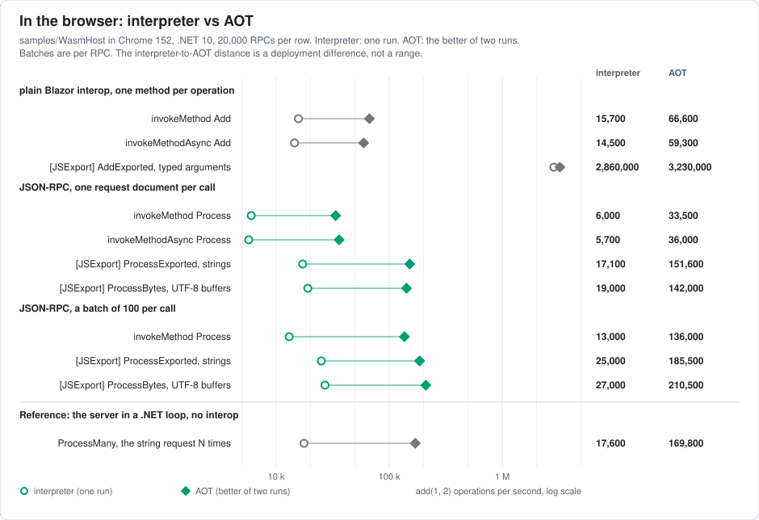

# WasmHost: JSON-RPC.Net running in the browser

A standalone Blazor WebAssembly app that hosts a JSON-RPC.Net server inside the page. There is no HTTP
and no Kestrel: JavaScript hands a request to the server through JS interop and reads the response back,
either as a string (`JsonRpcProcessor.ProcessSync`) or as UTF-8 bytes written straight into WebAssembly
memory (`JsonRpcProcessor.Process`). Both paths are measured below.

```
dotnet run --project samples/WasmHost
```

Open http://localhost:5199, type a request or send the sample batch, and read the response. The "Ask where
it runs" button calls a method that reports the OS and architecture the code sees (`Browser / Wasm`).

The relevant pieces:

- [Program.cs](Program.cs): a `JsonRpcService` with three methods, constructed at startup so it binds to
  the default session, and the `JsonRpcInterop` class that JavaScript calls into.
- [wwwroot/index.html](wwwroot/index.html): starts the runtime with `Blazor.start()`, calls
  `DotNet.invokeMethod('WasmHost', 'Process', json)`, and contains the benchmark below.

The sample targets `net10.0` and needs the .NET 10 SDK. It references only the core project, which also
produces `net8.0`, `netstandard2.1` and `netstandard2.0` assets, has no JSON library dependency, and does not
use reflection emit, so it runs under the WebAssembly interpreter and under AOT
(`<RunAOTCompilation>true</RunAOTCompilation>`). The `wasm-tools` workload is needed only for the AOT publish.

## Benchmark: JSON-RPC vs plain Blazor interop

The page has a "Run benchmark" button that performs the same `add(1, 2)` through every way JavaScript can
reach .NET here, and reports calls per second, microseconds per call, and RPCs per second:

| Path | What it exercises |
|---|---|
| plain interop, `DotNet.invokeMethod('WasmHost','Add',1,2)` | one `[JSInvokable]` method per operation, the usual Blazor way; the runtime serialises the argument array and the result with System.Text.Json |
| plain interop, `invokeMethodAsync` | the same through the promise-returning call |
| plain interop, `exports.JsonRpcInterop.AddExported(1,2)` | one `[JSExport]` method per operation (`System.Runtime.InteropServices.JavaScript`), which marshals each parameter directly with no JSON |
| JSON-RPC, `invokeMethod('WasmHost','Process',request)` | one `[JSInvokable]` entry point for every method: a request document in, the response document out |
| JSON-RPC, `invokeMethodAsync` | the same through the promise-returning call |
| JSON-RPC, `exports.JsonRpcInterop.ProcessExported(request)` | the same entry point as a `[JSExport]`, strings marshalled by the runtime |
| JSON-RPC, `ProcessBytes`, UTF-8 buffers | JavaScript writes the request bytes into a pinned buffer in WebAssembly memory (a `MemoryView` handed over once at start-up), calls a `[JSExport]` with the length, and reads the response bytes back; no string crosses the boundary and the server runs its byte-first entry point, the one the Kestrel package uses |
| JSON-RPC, batch of 100 per call | the three interop flavours with a 100-request batch document per call |
| JSON-RPC in a .NET loop | `ProcessMany` runs the string request N times inside .NET: the cost of the server itself in this runtime, no interop |

Measured on an 8-core desktop in Chrome 152 with .NET 10, 20,000 RPCs per row, once under the interpreter
(`dotnet run`, no AOT) and once AOT-compiled (`dotnet publish -c Release` with the `wasm-tools` workload; the
better of two runs per row). These are illustrative observations from one machine, not confidence intervals:
the better of two runs favours the faster observation, and a future update should report a median and range
over a fixed number of runs.

| Path | interpreter, µs per call | RPC/s | AOT, µs per call | RPC/s |
|---|---:|---:|---:|---:|
| plain interop, `invokeMethod Add` | 63.7 | 15,700 | 15.0 | 66,600 |
| plain interop, `invokeMethodAsync Add` | 68.8 | 14,500 | 16.9 | 59,300 |
| plain interop, `[JSExport] AddExported` | 0.35 | 2,860,000 | 0.31 | 3,230,000 |
| JSON-RPC, `invokeMethod Process` | 168.0 | 6,000 | 29.9 | 33,500 |
| JSON-RPC, `invokeMethodAsync Process` | 175.0 | 5,700 | 27.8 | 36,000 |
| JSON-RPC, `[JSExport] ProcessExported` | 58.4 | 17,100 | 6.6 | 151,600 |
| JSON-RPC, `[JSExport] ProcessBytes`, UTF-8 buffers | 52.6 | 19,000 | 7.0 | 142,000 |
| JSON-RPC, `invokeMethod Process`, batch of 100 | 7,706 per batch | 13,000 | 733 per batch | 136,000 |
| JSON-RPC, `[JSExport] ProcessExported`, batch of 100 | 3,998 per batch | 25,000 | 539 per batch | 185,500 |
| JSON-RPC, `[JSExport] ProcessBytes`, batch of 100, UTF-8 buffers | 3,706 per batch | 27,000 | 475 per batch | 210,500 |
| JSON-RPC in a .NET loop, no interop | 56.9 | 17,600 | 5.9 | 169,800 |

<picture>
  <source media="(prefers-color-scheme: dark)" srcset="../../benchmarks/charts/wasm-interop-dark.svg">
  
</picture>

What the numbers say:

- **`[JSInvokable]` interop is the expensive part, not the RPC.** A plain `invokeMethod` call that adds two
  numbers costs about 64 µs, because the JSON marshalling of the argument array and result that the runtime
  does runs in the interpreter. Sending a whole JSON-RPC document through `[JSExport]` (58 µs) is cheaper
  than that.
- **Bytes avoid the string marshalling.** Under the interpreter the UTF-8 buffer path (53 µs) is faster than
  the string `[JSExport]` (58 µs) and than the string request in a pure .NET loop (57 µs): with no string
  marshalled and no UTF-16 to UTF-8 transcoding, what remains is the parse, dispatch and response write
  themselves. Under AOT the two single-request rows are within noise of each other (6.6 µs for the string,
  7.0 µs for the bytes), so this table does not show a universal advantage for bytes; the batch rows favour
  bytes in both columns.
- **One entry point, batched, beats one interop call per operation.** A batch of 100 over the byte path
  gets to 27,000 RPC/s (37 µs per request), well above the single-call `[JSInvokable]` rate for a bare add.
  If the page has many calls to make at once, batch them.
- **`[JSExport]` with typed arguments is the fastest way to call one method** (0.35 µs) when the method has a
  fixed signature, and it is fast for one reason: there is no JSON anywhere. The generated stub takes the two
  doubles out of a fixed argument buffer in WebAssembly memory, calls the method and writes the double back;
  the interpreter executes a handful of instructions. JSON-RPC pays for its generality: any method, any
  parameters, batches, errors, and the same service code as the server, through one exported function.
- **The interpreter is the bottleneck, and AOT removes most of it.** AOT-compiled, the JSON-RPC rows are 7 to
  9× faster (a document through the byte path drops from 53 µs to 7 µs, the .NET loop from 57 µs to 5.9 µs, a
  batch of 100 over bytes reaches 210,000 RPC/s) and the `[JSInvokable]` rows 3 to 4×, while the typed
  `[JSExport]` add, which had almost no interpreted code to begin with, stays at 0.3 µs. Under AOT the interop
  costs about 1 µs of the 7 (compare the byte path with the .NET loop); the rest is the server itself in
  WebAssembly. On the .NET 10 JIT the top-level README's one-thread run measures about 217 ns per request for
  a similar five-request mix, a different harness and workload, so AOT WebAssembly is roughly 30× off native
  and the interpreter roughly 240×.

How to get the most out of it, in order of payoff:

1. **AOT-compile the app.** `dotnet workload install wasm-tools` (needs an elevated prompt on Windows), then
   `dotnet publish -c Release` produces an AOT build under `bin/Release/net10.0/publish/wwwroot` (the project
   turns `RunAOTCompilation` on for publish; pass `-p:Aot=false` to publish interpreted). Serve that folder
   with any static server (`python -m http.server --directory <that folder>` will do) and the page reports
   "AOT-compiled" next to "ready". The typed add stub barely changes; the JSON-RPC rows, which are .NET code,
   get 7 to 9× faster, as the AOT columns above show.
2. **Enter through `[JSExport]`, not `invokeMethod`.** Same document, 3× faster under the interpreter and
   4× under AOT, no loss of generality. Use the UTF-8 buffer form (`ProcessBytes` above) when the page already
   has bytes or wants to batch; for one string request the two `[JSExport]` forms cost about the same.
3. **Batch.** Per-document setup is amortised.
4. **Typed `[JSExport]` stubs for the two or three hottest methods**, JSON-RPC for everything else.
